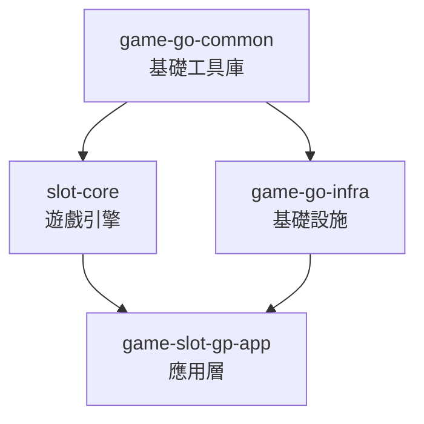
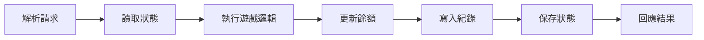
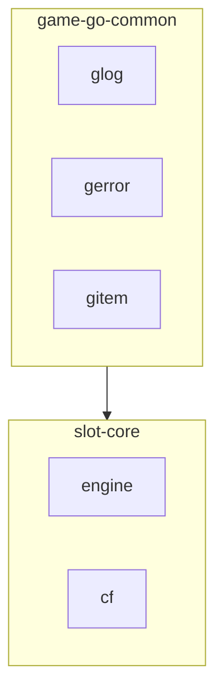
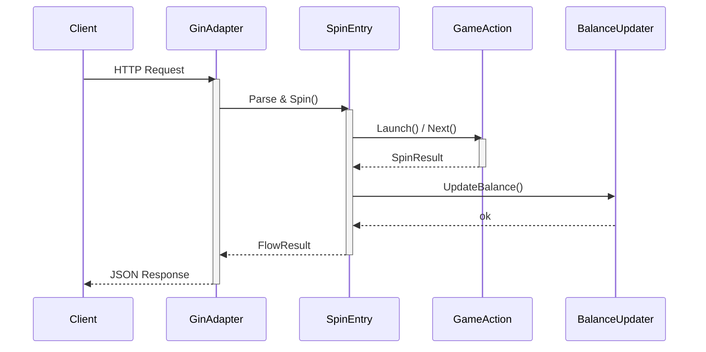
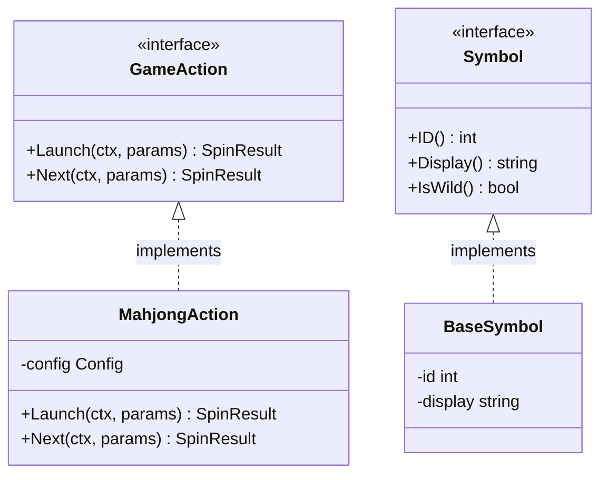
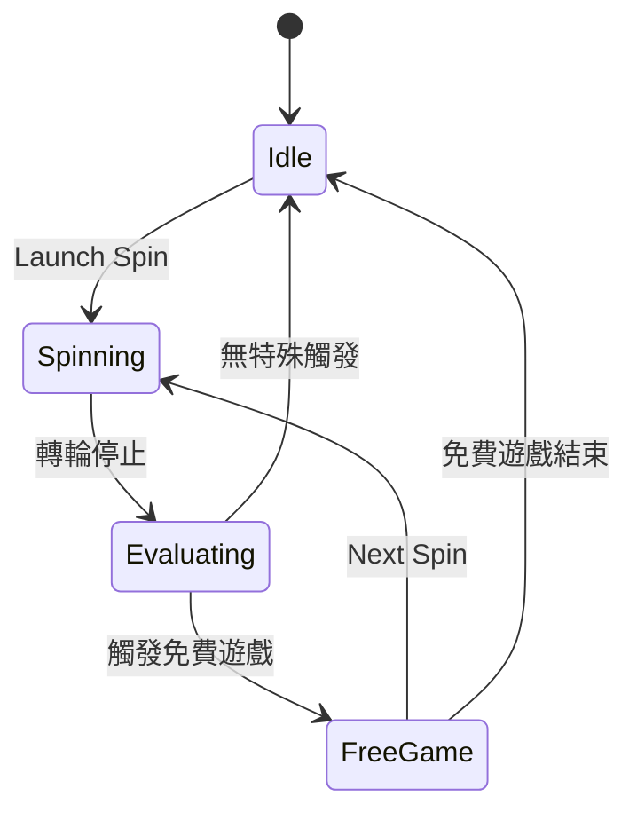
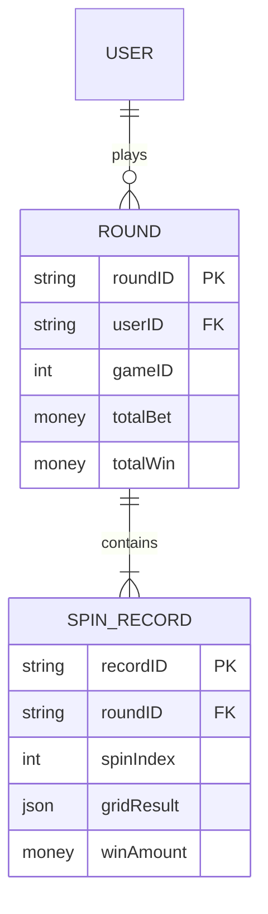

# Mermaid Diagram Examples

Per-type syntax examples for reference. Load this file when producing Mermaid diagrams.

---

## Flowchart (Module Dependencies / Pipeline)

Top-down for hierarchies:

Left-to-right for pipelines:

With subgraph grouping:

---

## Sequence Diagram (Component Interaction)

---

## Class Diagram (Interface / Struct Relationships)

---

## State Diagram (Game State / Lifecycle)

---

## ER Diagram (Data Model)

---

## Combining Diagrams

When documenting a complex feature, use multiple diagram types in one document:

1. **flowchart** for the high-level architecture or module dependency
2. **sequenceDiagram** for the runtime interaction between components
3. **stateDiagram-v2** for any state machine or lifecycle
4. **classDiagram** for interface/struct type relationships if needed

Choose the minimum set of diagrams that fully conveys the feature. Avoid redundancy between diagrams.
