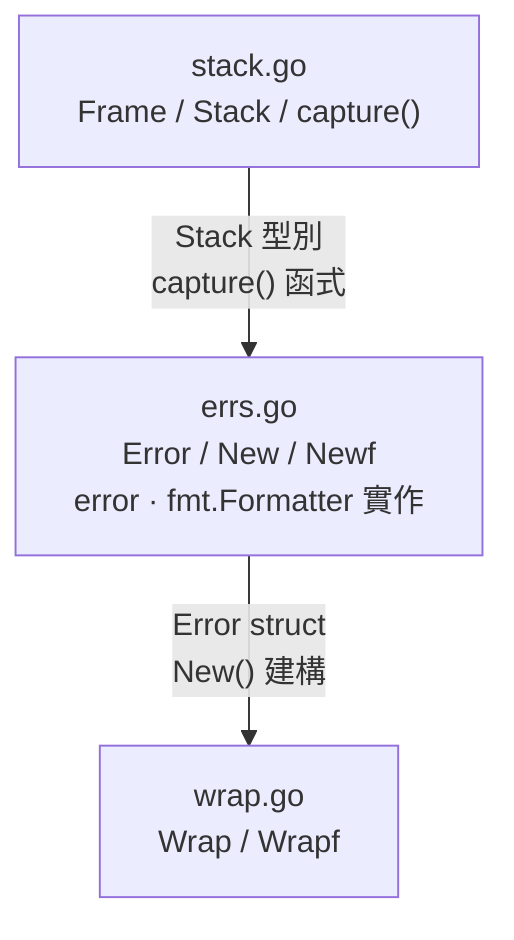

# Error 模組實作計畫 — `pkg/errs`

## 快速導覽

- [問題與目標](#問題與目標)
- [範圍](#範圍)
- [設計決策紀錄](#設計決策紀錄)
- [主管審查結論](#主管審查結論)
- [方案概述](#方案概述)
- [Public API](#public-api)
- [格式與相容性契約](#格式與相容性契約)
- [Stack Trace 輸出格式](#stack-trace-輸出格式)
- [模組內部結構](#模組內部結構)
- [影響檔案](#影響檔案)
- [分階段實作](#分階段實作)
- [測試與驗收標準](#測試與驗收標準)
- [風險與待確認事項](#風險與待確認事項)

---

## 問題與目標

專案目前**完全沒有 error handling 基礎設施**：無自訂 error 型別、無 wrapping pattern、無 stack trace、無 error code。所有函式要嘛不回傳 error，要嘛忽略 error return value（如 `http.ResponseWriter.Write()`）。

**目標**：建立 `pkg/errs` 模組，提供帶有 error code 與自動捕獲 stack trace 的結構化錯誤，作為整個專案 error handling 的統一基礎設施。

| 目標 | 說明 |
|------|------|
| Error code | 每個 error 強制攜帶 code string（如 `"USER_NOT_FOUND"`） |
| Stack trace | 建立 error 時自動捕獲 call stack，`%+v` 印出 Java-style trace |
| Cause chain | 支援 `Wrap` 建立 error chain，stdlib `errors.Is` / `errors.As` 自動走 chain |
| Downstream integration | 需提供 `pkg/log` 可直接消費的結構化欄位 accessors，不可要求下游解析字串 |
| 零外部依賴 | 模組本體只使用 Go stdlib（測試允許引入 `testify`） |

[返回開頭](#快速導覽)

---

## 範圍

### 包含

- `pkg/errs/stack.go`：Frame / Stack 型別與 capture
- `pkg/errs/errs.go`：Error struct、建構函式、interface 實作
- `pkg/errs/wrap.go`：Wrap / Wrapf
- `pkg/errs/errs_test.go`：完整單元測試
- `go.mod` 加入 `testify`（test dependency）

### 不包含

- 不改寫 `internal/` 任何現有程式碼（後續另案推廣）
- 不處理 `pkg/log` 模組（見 [`docs-plan/log-plan.md`](log-plan.md)）
- 不實作 error registry / error catalog（屬進階議題）

[返回開頭](#快速導覽)

---

## 設計決策紀錄

| # | 議題 | 決策 | 理由 |
|---|------|------|------|
| D1 | 模組命名 | `pkg/errs` | 避免與 stdlib `errors` 衝突，import 時不需 alias |
| D2 | `code` 參數位置 | 所有建構函式第一個參數 | 強制每個 error 都有 code，無法遺漏 |
| D3 | stdlib chain helper 取捨 | **不 re-export** `errors.Is` / `errors.As` | 這只是 namespace sugar，沒有增加能力；v1 保持 API 貼近 Go 慣例 |
| D4 | Stack capture skip 值 | `New` / `Wrap` 各自計算 skip | 確保第一個 frame 是呼叫者，不是內部函式 |
| D5 | 測試框架 | 允許 `testify/assert` + `testify/require` | 符合專案 golang-guidelines，提升測試可讀性 |
| D6 | 對下游公開的資料 | 提供 `Message()` / `StackTrace()` accessor | `pkg/log` 需要 `error.message` / `error.stack`，不能靠 parse `Error()` 或 `%+v` |
| D7 | Convenience helper 取捨 | **不新增** `Code(err error)` | 這只是 `errors.As` + `Code()` 的語法糖，非 `pkg/log` 必要依賴；v1 先維持 API 精簡 |
| D8 | 格式契約 | 明確定義 `%s` / `%v` / `%q` / `%+v` 行為 | 避免不同輸出情境下結果漂移，方便測試與 log 整合 |
| D9 | Error code 規範 | `code` 必須為非空字串；v1 不自動正規化 | 保持 API 簡潔，先以 caller contract 管理 |
| D10 | `Wrap(nil, ...)` 行為 | 回傳 `nil` | 符合 Go 慣例，避免 caller 漏掉 nil guard 時把成功路徑轉成錯誤 |

[返回開頭](#快速導覽)

---

## 主管審查結論

以「能否覆蓋實務上大多數使用情境」的標準來看，**原版計畫還不夠完整，不能直接視為可實作**。核心缺口不是功能清單不夠多，而是幾個關鍵契約沒有定義清楚：

| 議題 | 原版缺口 | 風險 | 本次補強 |
|---|---|---|---|
| 跨模組整合 | 只有 `Code()`，沒有 raw `message` / `stack` accessor | [`pkg/log`](log-plan.md) 無法安全注入 `error.message` / `error.stack` | 新增 `Message()` / `StackTrace()` 契約 |
| API 表面積控制 | `Code(err error)` 只提供 convenience，不是缺少它就做不到 | 基礎模組 v1 容易被塞進過多 sugar API，長期難收斂 | 明確排除 `Code(err error)`，改由 stdlib `errors.As` 顯式抽取 |
| stdlib helper re-export | `errs.Is` / `errs.As` 只是把 stdlib 名稱搬家 | 讀者會多學一層專案專用別名，降低可攜性 | 明確排除 re-export，直接使用 stdlib `errors.Is` / `errors.As` |
| 非 `*errs.Error` cause | `Wrap(err error, ...)` 接受任何 `error`，但 `%+v` 只定義了 `[CODE] message` 鏈 | 一旦 wrap stdlib error，格式規則會失真或實作時臨時發明行為 | 明確定義 plain `error` 的 fallback 輸出 |
| `fmt` 多 verb 行為 | 只寫 `%+v`，沒定義 `%v` / `%s` / `%q` | 不同 call site 可能輸出不一致，測試也難穩定 | 補上完整 formatter 契約 |
| `Wrap(nil, ...)` | 若行為與 Go 慣例不一致，最容易讓 caller 誤用 | `return errs.Wrap(err, ...)` 在成功路徑可能意外變成非 nil error | 已定案為 `Wrap(nil, ...) == nil`，並納入驗收標準 |
| 輸出穩定性 | 檔名與 function 名稱是否正規化未定義 | 測試容易綁死機器絕對路徑或 Go runtime 細節 | 補上 basename 與 assertion 策略 |

**結論**：補完本次增修後，計畫才接近可覆蓋「自行建立 error、wrap 既有 error、與 log 模組整合、不同 fmt 輸出情境」，且 API 表面積已收斂到真正必要的能力。

[返回開頭](#快速導覽)

---

## 方案概述

### Core Type

```go
// Error 代表帶有 error code 與 stack trace 的應用層錯誤。
type Error struct {
    code    string // e.g. "USER_NOT_FOUND"
    message string
    cause   error  // 支援 chain（可 nil）
    stack   Stack  // 建立時自動捕獲
}
```

### Stack 型別

```go
// Frame 代表 call stack 中的一個位置。
type Frame struct {
    Function string
    File     string
    Line     int
}

// Stack 代表建立 error 時捕獲的 call stack。
type Stack []Frame
```

### 關鍵設計

1. **Stack capture**：`runtime.Callers` + `runtime.CallersFrames`，`capture(skip)` 負責捕獲
2. **`code` 必傳**：`New(code, msg)` / `Wrap(err, code, msg)` 第一個參數即為 code
3. **`error` interface**：`Error()` 回傳 `[CODE] message`
4. **Chain support**：`Unwrap() error` 讓 stdlib `errors.Is` / `errors.As` 走 cause chain
5. **`fmt.Formatter`**：`%+v` 印出完整 stack trace + cause chain
6. **Go 慣例優先**：chain 檢查直接使用 stdlib `errors.Is` / `errors.As`
7. **下游整合**：`Message()` / `StackTrace()` 提供原始欄位，不要求下游解析字串格式
8. **API 克制**：不為了少打一點字就新增 re-export 或 convenience helper
9. **不可變資料**：`StackTrace()` 回傳 defensive copy，避免外部修改內部 stack

### Interface 靜態驗證

遵循專案 golang-guidelines Rule 1：

```go
var _ error         = (*Error)(nil)
var _ fmt.Formatter = (*Error)(nil)
```

[返回開頭](#快速導覽)

---

## Public API

```go
// 建構
func New(code, message string) *Error
func Newf(code, format string, args ...any) *Error

// 包裝
func Wrap(err error, code, message string) *Error
func Wrapf(err error, code, format string, args ...any) *Error

// 取值
func (e *Error) Code() string
func (e *Error) Message() string
func (e *Error) StackTrace() Stack
func (e *Error) Error() string           // "[CODE] message"
func (e *Error) Unwrap() error
func (e *Error) Format(f fmt.State, verb rune) // %+v = full trace
```

[返回開頭](#快速導覽)

---

## 格式與相容性契約

### Accessor 契約

- `Code()`：回傳當前 `*Error` 的 code
- `Message()`：回傳**未帶 `[CODE]` prefix** 的原始 message
- `StackTrace()`：回傳 defensive copy，供下游模組安全讀取 stack
- 若 caller 手上只有 `error` 介面值，直接使用 stdlib `errors.As` 抽取 `*Error`

### `fmt.Formatter` 契約

| Verb | 行為 |
|---|---|
| `%s` | 等同 `Error()` |
| `%v` | 等同 `Error()` |
| `%q` | 對 `Error()` 的結果做 quoted string 輸出 |
| `%+v` | 輸出完整 stack trace 與 cause chain |

### `%+v` 的 cause 相容性

- 若 cause 是 `*Error`：輸出 `Caused by: [CODE] message`，並附上該 cause 自己的 stack
- 若 cause 是一般 `error`：輸出 `Caused by: {cause.Error()}`，**不憑空偽造 code 或 stack**
- 若 cause 還可透過 `errors.Unwrap` 繼續展開，formatter 持續走 chain；只有 `*Error` 節點會附 stack

### 穩定輸出策略

- frame 中的檔名使用 `filepath.Base(frame.File)`，避免測試綁死機器絕對路徑
- function 名稱保留 runtime 提供的值；測試應以 suffix / contains 驗證，不綁死完整 module path
- nil receiver 應安全處理：`(*Error)(nil)` 的 `Error()` / `Format()` 不可 panic，輸出遵循 Go 慣例的 `<nil>`

[返回開頭](#快速導覽)

---

## Stack Trace 輸出格式

模仿 Java `printStackTrace`，讓 `%+v` 輸出：

```
[DB_TIMEOUT] connection timed out
    at main.loadUser (main.go:42)
    at main.handleRequest (main.go:28)
    at net/http.HandlerFunc.ServeHTTP (server.go:2166)
Caused by: [CONN_FAILED] tcp dial failed
    at db.Connect (db.go:15)
```

格式規則：

- 第一行：`[CODE] message`
- 每個 frame：`    at {Function} ({File}:{Line})`（4 空格縮排），其中 `{File}` 為 basename
- `*Error` cause：`Caused by: [CODE] message` + 該 cause 的 stack
- 一般 `error` cause：`Caused by: {cause.Error()}`，不印 synthetic stack
- `nil` cause 時不印 `Caused by:` 區塊

對一般 `error` 的 fallback 範例如下：

```
[DB_QUERY_FAILED] load user failed
    at example/repository.(*UserRepo).FindByID (repository.go:41)
Caused by: sql: no rows in result set
```

[返回開頭](#快速導覽)

---

## 模組內部結構

3 個原始碼檔案有明確的建構順序。`stack.go` 提供底層 capture 能力，`errs.go` 組合出核心 `Error` struct，`wrap.go` 在其上層提供 wrap helper：



> 箭頭表示建構依賴方向（先寫 → 後寫）。

[返回開頭](#快速導覽)

---

## 影響檔案

| 操作 | 檔案路徑 | 說明 |
|------|---------|------|
| 新增 | `pkg/errs/stack.go` | Frame / Stack / capture |
| 新增 | `pkg/errs/errs.go` | Error struct / 建構函式 / accessor / interface 實作 |
| 新增 | `pkg/errs/wrap.go` | Wrap / Wrapf |
| 新增 | `pkg/errs/errs_test.go` | 單元測試 |
| 修改 | `go.mod` / `go.sum` | 加入 `testify` test dependency |

[返回開頭](#快速導覽)

---

## 分階段實作

| 步驟 | 檔案 | 重點 |
|------|------|------|
| 1 | `pkg/errs/stack.go` | `Frame` struct（Function / File / Line）、`Stack` type alias、`capture(skip int) Stack` 使用 `runtime.Callers` + `runtime.CallersFrames` |
| 2 | `pkg/errs/errs.go` | `Error` struct（code / message / cause / stack）、`New` / `Newf` 建構函式（內部呼叫 `capture`）、`Code()` / `Message()` / `StackTrace()` / `Error()` / `Unwrap()` / `Format()` 方法、interface 靜態驗證 |
| 3 | `pkg/errs/wrap.go` | `Wrap(err, code, msg)` / `Wrapf(err, code, fmt, args...)`、一般 `error` chain 與 nil 行為 |
| 4 | `pkg/errs/errs_test.go` | Table-driven tests 覆蓋 E1–E12 所有驗收項目 |
| 5 | 驗證 | `go build ./pkg/errs/...` && `go test ./pkg/errs/... -v` && `go vet ./pkg/errs/...` |

[返回開頭](#快速導覽)

---

## 測試與驗收標準

| # | 驗收項目 | 測試方式 | 指令 / 步驟 | 預期結果 |
|---|---------|---------|------------|---------|
| E1 | `New` 建立 error 含 code + raw message + stack | unit test | `go test ./pkg/errs/... -v -run TestNew` | `err.Code()` == code、`err.Message()` == raw message、`err.Error()` == `[CODE] msg`、`StackTrace()` 長度 > 0 |
| E2 | `Newf` 支援 format string | unit test | `go test ./pkg/errs/... -v -run TestNewf` | message 正確插值 |
| E3 | `Wrap` 保留一般 `error` cause chain | unit test | `go test ./pkg/errs/... -v -run TestWrap` | `errors.Is(wrapped, original)` == true |
| E4 | `Wrapf` 支援 format + chain | unit test | `go test ./pkg/errs/... -v -run TestWrapf` | 同 E2 + E3 |
| E5 | `Code()` / `Message()` accessor 可供下游直接讀取欄位 | unit test | `go test ./pkg/errs/... -v -run TestAccessors` | `Code()` 與 `Message()` 回傳 raw 欄位，不需 parse `Error()` |
| E6 | `StackTrace()` 回傳 defensive copy | unit test | `go test ./pkg/errs/... -v -run TestStackTraceCopy` | 呼叫端修改回傳 slice 不影響原始 error |
| E7 | `Unwrap` 讓 `errors.As` 能走 chain | unit test | `go test ./pkg/errs/... -v -run TestAs` | `errors.As` 可取出 inner `*Error` |
| E8 | `%s` / `%v` / `%q` 行為固定 | unit test | `go test ./pkg/errs/... -v -run TestFormatBasicVerbs` | `%s` / `%v` 等於 `Error()`，`%q` 為 quoted string |
| E9 | `%+v` 印出 Java-style stack trace，且能處理一般 `error` cause | unit test | `go test ./pkg/errs/... -v -run TestFormatVerbose` | 輸出含 `at func (file:line)`；`*Error` cause 有 stack；plain error cause 只有 `Caused by: ...` |
| E10 | Stack trace 第一個 frame 是呼叫者，檔名為 basename | unit test | `go test ./pkg/errs/... -v -run TestStackSkip` | 第一個 frame 的 function name 不含 `errs.New` / `errs.capture`；檔名不含專案絕對路徑 |
| E11 | nil receiver 與 nil cause 不 panic | unit test | `go test ./pkg/errs/... -v -run 'TestNil(Receiver|Cause)'` | `Unwrap()` 回傳 nil，`%+v` / `Error()` 對 nil receiver 不 panic |
| E12 | `Wrap(nil, ...)` 回傳 `nil` | unit test | `go test ./pkg/errs/... -v -run TestWrapNil` | `Wrap(nil, ...) == nil`，`Wrapf(nil, ...) == nil` |
| E13 | 編譯通過 | build | `go build ./pkg/errs/...` | 零錯誤 |
| E14 | 靜態分析通過 | vet | `go vet ./pkg/errs/...` | 零警告 |

[返回開頭](#快速導覽)

---

## 風險與待確認事項

| # | 風險 / 議題 | 影響 | 緩解措施 |
|---|-----------|------|---------|
| R1 | `runtime.Callers` skip 值跨 Go 版本可能不同 | stack trace 第一個 frame 偏移 | 測試 E8 明確斷言 caller frame，CI 會在版本升級時捕獲 |
| R2 | `testify` 為專案首個外部依賴 | go.sum 變大 | 僅 test scope，不影響 production binary size |
| R3 | `Wrap(nil, ...) == nil` 與 `New(...)` 語義不同 | 新手可能誤以為 `Wrap` 也會建立新 error | 在 Public API、測試 E12 與實作註解中明確說明：建立新錯誤請用 `New` / `Newf` |
| R4 | `runtime.Frame.Function` 跨編譯器/版本的細節可能不同 | 若測試綁死完整名稱會變脆弱 | 測試只驗證 suffix / contains，不比對完整 module path |
| R5 | `code` 目前採 caller contract，未做 runtime validation | caller 仍可能傳空字串，破壞 observability | 文件明列「非空」要求；若未來有 registry/codelist，再升級為 compile/runtime enforcement |

[返回開頭](#快速導覽)
