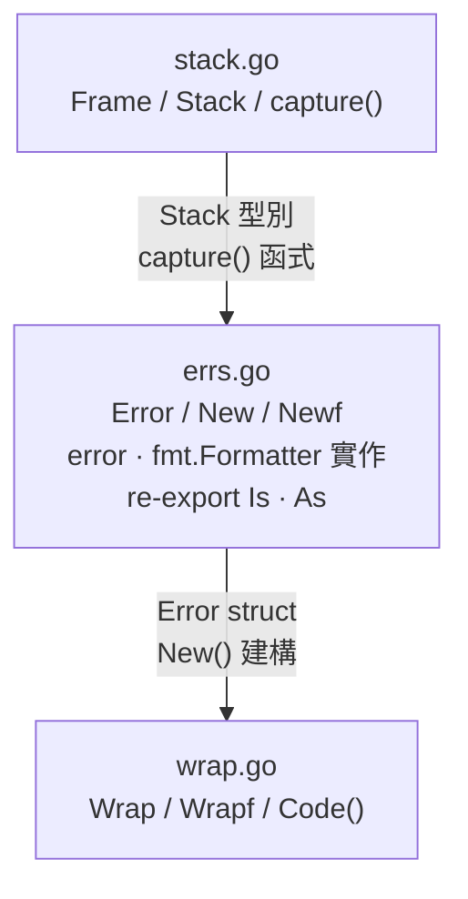

# Error 模組實作計畫 — `pkg/errs`

## 快速導覽

- [問題與目標](#問題與目標)
- [範圍](#範圍)
- [設計決策紀錄](#設計決策紀錄)
- [方案概述](#方案概述)
- [Public API](#public-api)
- [Stack Trace 輸出格式](#stack-trace-輸出格式)
- [模組內部結構](#模組內部結構)
- [影響檔案](#影響檔案)
- [分階段實作](#分階段實作)
- [測試與驗收標準](#測試與驗收標準)
- [風險與待確認事項](#風險與待確認事項)

---

## 問題與目標

專案目前**完全沒有 error handling 基礎設施**：無自訂 error 型別、無 wrapping pattern、無 stack trace、無 error code。所有函式要嘛不回傳 error，要嘛忽略 error return value（如 `http.ResponseWriter.Write()`）。

**目標**：建立 `pkg/errs` 模組，提供帶有 error code 與自動捕獲 stack trace 的結構化錯誤，作為整個專案 error handling 的統一基礎設施。

| 目標 | 說明 |
|------|------|
| Error code | 每個 error 強制攜帶 code string（如 `"USER_NOT_FOUND"`） |
| Stack trace | 建立 error 時自動捕獲 call stack，`%+v` 印出 Java-style trace |
| Cause chain | 支援 `Wrap` 建立 error chain，stdlib `errors.Is` / `errors.As` 自動走 chain |
| 零外部依賴 | 模組本體只使用 Go stdlib（測試允許引入 `testify`） |

[返回開頭](#快速導覽)

---

## 範圍

### 包含

- `pkg/errs/stack.go`：Frame / Stack 型別與 capture
- `pkg/errs/errs.go`：Error struct、建構函式、interface 實作
- `pkg/errs/wrap.go`：Wrap / Wrapf / Code helper
- `pkg/errs/errs_test.go`：完整單元測試
- `go.mod` 加入 `testify`（test dependency）

### 不包含

- 不改寫 `internal/` 任何現有程式碼（後續另案推廣）
- 不處理 `pkg/log` 模組（見 [`docs-plan/log-plan.md`](log-plan.md)）
- 不實作 error registry / error catalog（屬進階議題）

[返回開頭](#快速導覽)

---

## 設計決策紀錄

| # | 議題 | 決策 | 理由 |
|---|------|------|------|
| D1 | 模組命名 | `pkg/errs` | 避免與 stdlib `errors` 衝突，import 時不需 alias |
| D2 | `code` 參數位置 | 所有建構函式第一個參數 | 強制每個 error 都有 code，無法遺漏 |
| D3 | Re-export `Is` / `As` | `var Is = errors.Is`、`var As = errors.As` | 使用者不需同時 import `errors` 和 `errs` 兩個 package |
| D4 | Stack capture skip 值 | `New` / `Wrap` 各自計算 skip | 確保第一個 frame 是呼叫者，不是內部函式 |
| D5 | 測試框架 | 允許 `testify/assert` + `testify/require` | 符合專案 golang-guidelines，提升測試可讀性 |

[返回開頭](#快速導覽)

---

## 方案概述

### Core Type

```go
// Error 代表帶有 error code 與 stack trace 的應用層錯誤。
type Error struct {
    code    string // e.g. "USER_NOT_FOUND"
    message string
    cause   error  // 支援 chain（可 nil）
    stack   Stack  // 建立時自動捕獲
}
```

### Stack 型別

```go
// Frame 代表 call stack 中的一個位置。
type Frame struct {
    Function string
    File     string
    Line     int
}

// Stack 代表建立 error 時捕獲的 call stack。
type Stack []Frame
```

### 關鍵設計

1. **Stack capture**：`runtime.Callers` + `runtime.CallersFrames`，`capture(skip)` 負責捕獲
2. **`code` 必傳**：`New(code, msg)` / `Wrap(err, code, msg)` 第一個參數即為 code
3. **`error` interface**：`Error()` 回傳 `[CODE] message`
4. **Chain support**：`Unwrap() error` 讓 stdlib `errors.Is` / `errors.As` 走 cause chain
5. **`fmt.Formatter`**：`%+v` 印出完整 stack trace + cause chain
6. **Re-export**：讓使用者只需 import `errs` 一個 package

### Interface 靜態驗證

遵循專案 golang-guidelines Rule 1：

```go
var _ error         = (*Error)(nil)
var _ fmt.Formatter = (*Error)(nil)
```

[返回開頭](#快速導覽)

---

## Public API

```go
// 建構
func New(code, message string) *Error
func Newf(code, format string, args ...any) *Error

// 包裝
func Wrap(err error, code, message string) *Error
func Wrapf(err error, code, format string, args ...any) *Error

// 取值
func (e *Error) Code() string
func (e *Error) Error() string           // "[CODE] message"
func (e *Error) Unwrap() error
func (e *Error) Format(f fmt.State, verb rune) // %+v = full trace

// Re-export stdlib
var Is = errors.Is
var As = errors.As
```

[返回開頭](#快速導覽)

---

## Stack Trace 輸出格式

模仿 Java `printStackTrace`，讓 `%+v` 輸出：

```
[DB_TIMEOUT] connection timed out
    at main.loadUser (main.go:42)
    at main.handleRequest (main.go:28)
    at net/http.HandlerFunc.ServeHTTP (server.go:2166)
Caused by: [CONN_FAILED] tcp dial failed
    at db.Connect (db.go:15)
```

格式規則：

- 第一行：`[CODE] message`
- 每個 frame：`    at {Function} ({File}:{Line})`（4 空格縮排）
- Cause chain：`Caused by: [CODE] message` + 該 cause 的 stack
- `nil` cause 時不印 `Caused by:` 區塊

[返回開頭](#快速導覽)

---

## 模組內部結構

3 個原始碼檔案有明確的建構順序。`stack.go` 提供底層 capture 能力，`errs.go` 組合出核心 `Error` struct，`wrap.go` 在其上層提供 wrap helper：



> 箭頭表示建構依賴方向（先寫 → 後寫）。

[返回開頭](#快速導覽)

---

## 影響檔案

| 操作 | 檔案路徑 | 說明 |
|------|---------|------|
| 新增 | `pkg/errs/stack.go` | Frame / Stack / capture |
| 新增 | `pkg/errs/errs.go` | Error struct / 建構函式 / interface 實作 / re-export |
| 新增 | `pkg/errs/wrap.go` | Wrap / Wrapf / Code helper |
| 新增 | `pkg/errs/errs_test.go` | 單元測試 |
| 修改 | `go.mod` / `go.sum` | 加入 `testify` test dependency |

[返回開頭](#快速導覽)

---

## 分階段實作

| 步驟 | 檔案 | 重點 |
|------|------|------|
| 1 | `pkg/errs/stack.go` | `Frame` struct（Function / File / Line）、`Stack` type alias、`capture(skip int) Stack` 使用 `runtime.Callers` + `runtime.CallersFrames` |
| 2 | `pkg/errs/errs.go` | `Error` struct（code / message / cause / stack）、`New` / `Newf` 建構函式（內部呼叫 `capture`）、`Code()` / `Error()` / `Unwrap()` / `Format()` 方法、`var Is` / `var As` re-export、interface 靜態驗證 |
| 3 | `pkg/errs/wrap.go` | `Wrap(err, code, msg)` / `Wrapf(err, code, fmt, args...)`：建立新 `Error` 並設定 `cause`、自動捕獲新 stack |
| 4 | `pkg/errs/errs_test.go` | Table-driven tests 覆蓋 E1–E9 所有驗收項目 |
| 5 | 驗證 | `go build ./pkg/errs/...` && `go test ./pkg/errs/... -v` && `go vet ./pkg/errs/...` |

[返回開頭](#快速導覽)

---

## 測試與驗收標準

| # | 驗收項目 | 測試方式 | 指令 / 步驟 | 預期結果 |
|---|---------|---------|------------|---------|
| E1 | `New` 建立 error 含 code + message + stack | unit test | `go test ./pkg/errs/... -v -run TestNew` | `err.Code()` == code、`err.Error()` == `[CODE] msg`、stack 長度 > 0 |
| E2 | `Newf` 支援 format string | unit test | `go test ./pkg/errs/... -v -run TestNewf` | message 正確插值 |
| E3 | `Wrap` 保留 cause chain | unit test | `go test ./pkg/errs/... -v -run TestWrap` | `errors.Is(wrapped, original)` == true |
| E4 | `Wrapf` 支援 format + chain | unit test | `go test ./pkg/errs/... -v -run TestWrapf` | 同 E2 + E3 |
| E5 | `Code()` 回傳最外層 error 的 code | unit test | `go test ./pkg/errs/... -v -run TestCode` | 回傳最外層 error 的 code string |
| E6 | `Unwrap` 讓 `errors.As` 能走 chain | unit test | `go test ./pkg/errs/... -v -run TestAs` | `errors.As` 可取出 inner `*Error` |
| E7 | `%+v` 印出 Java-style stack trace | unit test | `go test ./pkg/errs/... -v -run TestFormat` | 輸出含 `at func (file:line)` 格式，多層 cause 有 `Caused by:` |
| E8 | Stack trace 第一個 frame 是呼叫者 | unit test | `go test ./pkg/errs/... -v -run TestStackSkip` | 第一個 frame 的 function name 不含 `errs.New` / `errs.capture` |
| E9 | `nil` cause 不 panic | unit test | `go test ./pkg/errs/... -v -run TestNilCause` | `Unwrap()` 回傳 nil，`%+v` 無 `Caused by:` |
| E10 | 編譯通過 | build | `go build ./pkg/errs/...` | 零錯誤 |
| E11 | 靜態分析通過 | vet | `go vet ./pkg/errs/...` | 零警告 |

[返回開頭](#快速導覽)

---

## 風險與待確認事項

| # | 風險 / 議題 | 影響 | 緩解措施 |
|---|-----------|------|---------|
| R1 | `runtime.Callers` skip 值跨 Go 版本可能不同 | stack trace 第一個 frame 偏移 | 測試 E8 明確斷言 caller frame，CI 會在版本升級時捕獲 |
| R2 | `testify` 為專案首個外部依賴 | go.sum 變大 | 僅 test scope，不影響 production binary size |
| R3 | `Wrap` 對 `nil` error 的行為未定義 | caller 可能傳入 nil | 在 `Wrap` / `Wrapf` 中加 nil guard，回傳只帶 code+message 的 Error（無 cause） |

[返回開頭](#快速導覽)
