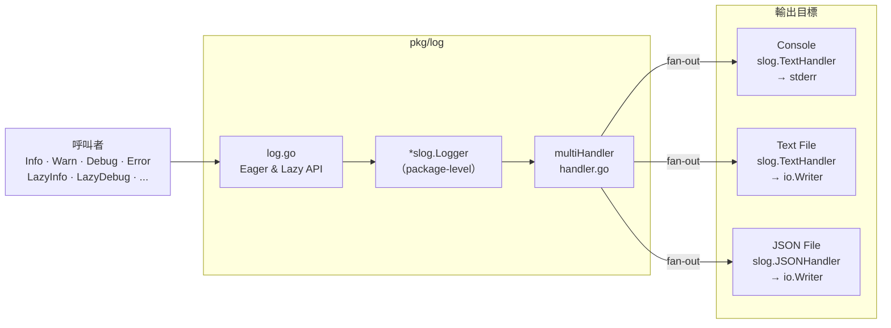
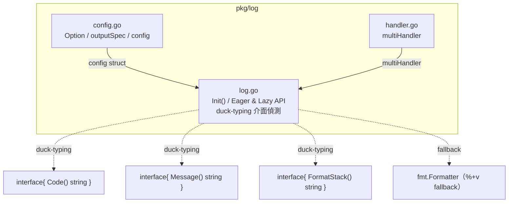

# Log 模組實作計畫 — `pkg/log`

## 快速導覽

- [問題與目標](#問題與目標)
- [前置依賴](#前置依賴)
- [範圍](#範圍)
- [設計決策紀錄](#設計決策紀錄)
- [方案概述](#方案概述)
- [Configuration — Functional Options](#configuration--functional-options)
- [multiHandler](#multihandler)
- [Log Functions — Eager & Lazy](#log-functions--eager--lazy)
- [模組內部結構](#模組內部結構)
- [影響檔案](#影響檔案)
- [分階段實作](#分階段實作)
- [測試與驗收標準](#測試與驗收標準)
- [風險與待確認事項](#風險與待確認事項)

---

## 問題與目標

專案目前只有一個極簡的 [`pkg/logger/logger.go`](../pkg/logger/logger.go)（僅 `Info` / `Error` 兩個函式，wrapper around `log.Println`），且**全 codebase 零 import**——實質上沒有 logging 基礎設施。

**目標**：建立 `pkg/log` 模組，基於 `log/slog` 提供結構化日誌，支援多輸出 fan-out、Eager + Lazy API，並讓 Error log 強制攜帶結構化錯誤資訊。

| 目標 | 說明 |
|------|------|
| 結構化日誌 | 基於 `log/slog`，輸出 key-value 結構化記錄 |
| 多輸出 fan-out | 同一筆 log 可同時寫入 console + text file + JSON file |
| Eager + Lazy API | Lazy variant 避免 disabled level 下的 argument evaluation 與 allocation |
| Error 智慧偵測 | `log.Error()` 接受 `error` 介面，以 duck-typing 自動偵測 code / message / stack 結構化欄位；plain error graceful degradation |
| 零外部依賴 | 模組本體只使用 Go stdlib（測試允許引入 `testify`） |

[返回開頭](#快速導覽)

---

## 前置依賴

此模組**不 import `pkg/errs`**。`log.Error()` 內部以 duck-typing 介面偵測結構化欄位（`Code() string`、`Message() string`、`FormatStack() string`），全部使用 stdlib 型別，零跨模組耦合。另提供 `fmt.Formatter` + `%+v` fallback 支援第三方 error library。

**開始實作 `pkg/log` 之前，`pkg/errs` 必須完成並通過所有驗收標準（以驗證 duck-typing 相容性）。**

[返回開頭](#快速導覽)

---

## 範圍

### 包含

- `pkg/log/config.go`：Functional options 設定
- `pkg/log/handler.go`：multiHandler fan-out 實作
- `pkg/log/log.go`：Init、Eager & Lazy log functions
- `pkg/log/log_test.go`：完整單元測試
- `cmd/app/main.go`：Demo 驗證兩個模組（errs + log）整合
- 移除已廢棄的 `pkg/logger/logger.go`

### 不包含

- 不改寫 `internal/handler`、`internal/service`、`internal/repository`（後續另案推廣）
- 不引入外部 logging library（zap、logrus 等）
- 不實作 log rotation / async flush / buffered writer（屬進階議題）
- 不實作 `context.Context` 的 log value extraction（可於未來擴充）

[返回開頭](#快速導覽)

---

## 設計決策紀錄

| # | 議題 | 決策 | 理由 |
|---|------|------|------|
| D1 | `log.Error()` 參數型別 | 接受 `error` 介面，內部以 duck-typing 介面偵測結構化欄位 | 避免強迫消費端依賴 `pkg/errs`；`*errs.Error` 自動滿足介面，plain error graceful degradation |
| D2 | Level 管理 | `*slog.LevelVar` 共享給所有 handler | 支援 runtime 動態切換 level，不需重建 handler |
| D3 | 無 output 時的預設行為 | Fallback 到 console text（stderr） | 避免「忘了設定就什麼都看不到」的情況 |
| D4 | Init 執行安全性 | 文件規範「只在 main 啟動時呼叫一次」 | 避免 package-level global state 的 race condition |
| D5 | Lazy API | 提供 `LazyInfo` / `LazyDebug` / `LazyWarn` / `LazyError` | 避免 disabled level 下的 argument evaluation 與 slice allocation |
| D6 | 測試框架 | 允許 `testify/assert` + `testify/require` | 符合專案 golang-guidelines，提升測試可讀性 |
| D7 | Stack 偵測策略 | `FormatStack() string` 主偵測 + `fmt.Formatter` `%+v` fallback | Go interface 要求回傳型別完全一致，`StackTrace() errs.Stack` 無法做零耦合 duck-typing；`FormatStack()` 回傳 stdlib `string`，任何 error library 可實作；`fmt.Formatter` fallback 支援 `pkg/errors` 等既有 library |

[返回開頭](#快速導覽)

---

## 方案概述

### 架構總覽

`pkg/log` 由三個檔案組成。使用者透過 Functional Options 設定輸出目標，`Init()` 將 options 解析為 `slog.Handler` 並組裝進 `multiHandler`，最後 Eager / Lazy API 透過 package-level `*slog.Logger` 輸出日誌。

下圖展示使用者呼叫 → 內部元件 → 輸出目標的完整流程：



[返回開頭](#快速導覽)

---

## Configuration — Functional Options

```go
log.Init(
    log.WithLevel(slog.LevelDebug),
    log.WithConsole(),                 // stderr, text format
    log.WithTextFile(plainWriter),     // flat text file
    log.WithJSONFile(jsonWriter),      // JSON file
)
```

### 內部結構

```go
// config 匯集所有 Option 的設定意圖。
type config struct {
    level   slog.Leveler
    outputs []outputSpec
}

// outputSpec 描述單一輸出目標的意圖。
type outputSpec struct {
    format string    // "text" | "json"
    writer io.Writer
}

// Option 是 Init 的設定函式。
type Option func(*config)
```

### 行為規則

- Options 只記錄意圖（`outputSpec`），`Init()` 統一建構 `slog.Handler`
- 使用 `*slog.LevelVar` 讓所有 handler 共享同一個 level
- **預設行為**：未指定任何 output 時 fallback 到 console text（stderr）
- `WithLevel` 未指定時預設 `slog.LevelInfo`

[返回開頭](#快速導覽)

---

## multiHandler

實作 `slog.Handler` interface，fan-out 到 N 個子 handler。

| 方法 | 行為 |
|------|------|
| `Enabled(ctx, level)` | 任一子 handler enabled → 回傳 `true` |
| `Handle(ctx, record)` | 對每個 enabled 的子 handler 呼叫 `h.Handle(ctx, r.Clone())`；蒐集所有 error，回傳第一個 |
| `WithAttrs(attrs)` | 回傳新 `multiHandler`，每個子 handler 都套用 attrs |
| `WithGroup(name)` | 回傳新 `multiHandler`，每個子 handler 都套用 group |

### Interface 靜態驗證

```go
var _ slog.Handler = (*multiHandler)(nil)
```

[返回開頭](#快速導覽)

---

## Log Functions — Eager & Lazy

### Eager variants

直接對應 slog key-value：

```go
func Info(msg string, args ...any)
func Warn(msg string, args ...any)
func Debug(msg string, args ...any)
func Error(msg string, err error, args ...any) // 接受 error 介面
```

`Error` 以 duck-typing 偵測 error 是否攜帶結構化欄位，自動注入可用的 slog attributes：

| 偵測介面 | 條件 | 注入的 attribute |
|----------|------|-----------------|
| `codeProvider` | `err.(interface{ Code() string })` | `error.code` |
| `messageProvider` | `err.(interface{ Message() string })` | `error.message` |
| `stackProvider` | `err.(interface{ FormatStack() string })` | `error.stack` |
| `verboseProvider` | `err.(fmt.Formatter)` → `%+v` fallback | `error.verbose`（僅在無 `FormatStack()` 時） |
| — | 一律 | `error.text` = `err.Error()` |

這些介面定義在 `pkg/log` 內部（未匯出），遵循 golang-guidelines Rule 3。

**偵測策略（三層 fallback）**：

1. **`FormatStack() string`**：回傳 stdlib 型別，零跨模組耦合。`*errs.Error` 自動滿足。任何第三方 error library 只需實作同簽名方法即可相容。
2. **`fmt.Formatter` + `%+v` fallback**：對未實作 `FormatStack()` 但支援 `%+v`（如 `github.com/pkg/errors`）的 error，以 verbose 格式作為 fallback。
3. **plain error degradation**：僅記錄 `error.text`。

### Lazy variants

Closure 避免 disabled level 下的 allocation：

```go
func LazyInfo(msg string, f func() []any)
func LazyWarn(msg string, f func() []any)
func LazyDebug(msg string, f func() []any)
func LazyError(msg string, f func() (error, []any))
```

### Lazy 原理

Go variadic `...any` 在呼叫時就會 allocate slice 並 evaluate 所有參數。用 closure 包裝後，level disabled 時 closure body 完全不執行，零 allocation。

```go
// Eager：即使 DEBUG 關閉，user.String() 仍會被呼叫
log.Debug("loaded", "details", user.String())

// Lazy：DEBUG 關閉時 closure 不執行，user.String() 不會被呼叫
log.LazyDebug("loaded", func() []any {
    return []any{"details", user.String()}
})
```

[返回開頭](#快速導覽)

---

## 模組內部結構

3 個原始碼檔案的建構順序與依賴關係：



> `pkg/log` **不 import `pkg/errs`**。所有結構化欄位偵測皆透過 duck-typing 介面與 `fmt.Formatter`，零跨模組型別耦合。

[返回開頭](#快速導覽)

---

## 影響檔案

| 操作 | 檔案路徑 | 說明 |
|------|---------|------|
| 新增 | `pkg/log/config.go` | Functional options / config / outputSpec |
| 新增 | `pkg/log/handler.go` | multiHandler 實作 slog.Handler |
| 新增 | `pkg/log/log.go` | Init / Eager & Lazy API |
| 新增 | `pkg/log/log_test.go` | 單元測試 |
| 修改 | `cmd/app/main.go` | Demo 驗證 errs + log 整合 |
| 刪除 | `pkg/logger/logger.go` | 移除舊 logger（已確認零 import） |

[返回開頭](#快速導覽)

---

## 分階段實作

### Phase 1：`pkg/log` 核心

| 步驟 | 檔案 | 重點 |
|------|------|------|
| 1 | `pkg/log/config.go` | `config` struct、`Option` type、`WithLevel` / `WithConsole` / `WithTextFile` / `WithJSONFile`、`*slog.LevelVar` 共享 level |
| 2 | `pkg/log/handler.go` | `multiHandler` 實作 `slog.Handler`：`Enabled` / `Handle`（`r.Clone()`）/ `WithAttrs` / `WithGroup`、interface 靜態驗證 |
| 3 | `pkg/log/log.go` | `Init()` 解析 options 建構 handlers、Eager API（Info / Warn / Debug / Error）、Lazy API（LazyInfo / LazyDebug / LazyWarn / LazyError）、`Error()` 以 duck-typing 介面偵測 `error.code` / `error.message` / `error.stack`（`FormatStack() string`），`fmt.Formatter` `%+v` fallback 偵測 `error.verbose`，一律注入 `error.text` |
| 4 | `pkg/log/log_test.go` | Table-driven tests 覆蓋 L1–L9 所有驗收項目 |

### Phase 2：整合與清理

| 步驟 | 動作 | 重點 |
|------|------|------|
| 5 | 修改 `cmd/app/main.go` | Demo：`errs.New` / `Wrap` + `%+v`、`log.Init` 同時啟用 console + JSON、各 level eager & lazy 呼叫 |
| 6 | 刪除 `pkg/logger/logger.go` | 確認 grep 無 import 後移除 |
| 7 | 全專案驗證 | `go build ./...` && `go test ./... -v` && `go vet ./...` |

[返回開頭](#快速導覽)

---

## 測試與驗收標準

### `pkg/log` 驗收

| # | 驗收項目 | 測試方式 | 指令 / 步驟 | 預期結果 |
|---|---------|---------|------------|---------|
| L1 | `Init()` 無參數 fallback console | unit test | `go test ./pkg/log/... -v -run TestInitDefault` | 不 panic，logger 可正常寫出到 stderr |
| L2 | 多輸出 fan-out | unit test | `go test ./pkg/log/... -v -run TestMultiOutput` | 同一筆 log 同時出現在所有已註冊的 writer |
| L3 | Level 過濾正確 | unit test | `go test ./pkg/log/... -v -run TestLevelFilter` | Info level 下 Debug 訊息不出現 |
| L4 | `Error()` 自動偵測並注入 error attributes | unit test | `go test ./pkg/log/... -v -run TestErrorAttrs` | `*errs.Error` 的 JSON 輸出含 `error.code`、`error.message`、`error.stack`（via `FormatStack()`）、`error.text` |
| L5 | `Error()` 對 plain error graceful degradation | unit test | `go test ./pkg/log/... -v -run TestErrorPlain` | plain `error` 的 JSON 輸出含 `error.text`，不含 `error.code` / `error.stack` |
| L5b | `Error()` 對 `fmt.Formatter` error 的 fallback | unit test | `go test ./pkg/log/... -v -run TestErrorFormatterFallback` | 實作 `fmt.Formatter` 但無 `FormatStack()` 的 error，JSON 輸出含 `error.verbose` |
| L6 | Lazy closure 在 level disabled 時不執行 | unit test | `go test ./pkg/log/... -v -run TestLazySkip` | closure 內設置的 flag 未被觸發 |
| L7 | Lazy closure 在 level enabled 時正常執行 | unit test | `go test ./pkg/log/... -v -run TestLazyExecute` | log 輸出含 closure 回傳的 key-value |
| L8 | Runtime level 動態切換 | unit test | `go test ./pkg/log/... -v -run TestDynamicLevel` | 切換前 Debug 不輸出，切換後 Debug 輸出 |
| L9 | `WithAttrs` / `WithGroup` 正確傳遞 | unit test | `go test ./pkg/log/... -v -run TestHandlerChain` | 子 handler 都收到 attrs 和 group |

### 整合驗收

| # | 驗收項目 | 測試方式 | 指令 / 步驟 | 預期結果 |
|---|---------|---------|------------|---------|
| I1 | 全專案編譯 | CI / manual | `go build ./...` | 零錯誤 |
| I2 | 全測試通過 | CI / manual | `go test ./... -v` | 全部 PASS |
| I3 | 靜態分析通過 | CI / manual | `go vet ./...` | 零警告 |
| I4 | Demo 可執行 | manual | `go run ./cmd/app` | 終端印出多 level log、error stack trace，JSON 輸出可檢視 |
| I5 | 舊 logger 已移除 | manual | `grep -r "pkg/logger" --include="*.go"` | 零匹配 |

[返回開頭](#快速導覽)

---

## 風險與待確認事項

| # | 風險 / 議題 | 影響 | 緩解措施 |
|---|-----------|------|---------|
| R1 | `slog.Record.Clone()` 在高頻場景的 allocation 成本 | multiHandler fan-out 時每個子 handler 都 clone | 目前 N ≤ 3，可接受；若未來 handler 數量增加再考慮 pool |
| R2 | `log.Error()` 接受 `error` 介面，plain error 無結構化欄位 | 部分 error log 可能缺少 code / stack | Graceful degradation：一律記錄 `error.text`；搭配 golang-guidelines Rule 5 規範所有專案 error 使用 `pkg/errs`，plain error 僅在邊界（外部 lib）出現 |
| R3 | Package-level global logger 非 thread-safe init | 多 goroutine 同時呼叫 `Init()` 有 race | 文件明確規範「只在 main 啟動時呼叫一次」；若需要可加 `sync.Once` |
| R4 | 未實作 graceful shutdown / flush | 程式異常退出時可能遺失最後幾筆 log | 目前使用 unbuffered writer，影響有限；未來可擴充 `Close()` 方法 |

[返回開頭](#快速導覽)
