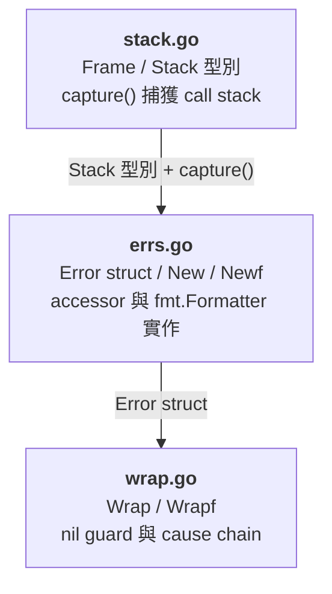

# `pkg/errs` — 結構化錯誤模組

## 快速導覽

- [概覽](#概覽)
- [快速開始](#快速開始)
- [Public API](#public-api)
- [格式契約](#格式契約)
- [Stack Trace 輸出格式](#stack-trace-輸出格式)
- [模組結構](#模組結構)
- [設計決策](#設計決策)
- [測試](#測試)
- [已知限制與注意事項](#已知限制與注意事項)

---

## 概覽

`pkg/errs` 提供帶有 **error code** 與自動捕獲 **stack trace** 的結構化錯誤型別，作為專案 error handling 的統一基礎設施。

| 能力 | 說明 |
|------|------|
| Error code | 每個 error 強制攜帶 code string（如 `"USER_NOT_FOUND"`） |
| Stack trace | 建立 error 時自動捕獲 call stack，`%+v` 印出 Java-style trace |
| Cause chain | 支援 `Wrap` 建立 error chain，stdlib `errors.Is` / `errors.As` 自動走訪 |
| 下游整合 | `Code()` / `Message()` / `StackTrace()` / `FormatStack()` 提供結構化欄位，供 [`pkg/log`](../docs-plan/log-plan.md) 等下游直接消費 |
| 零外部依賴 | 模組本體只使用 Go stdlib（測試使用 `testify`） |

[返回開頭](#快速導覽)

---

## 快速開始

### 建立根錯誤

```go
import "golan-example/pkg/errs"

err := errs.New("USER_NOT_FOUND", "user 12345 does not exist")
// err.Error() → "[USER_NOT_FOUND] user 12345 does not exist"

err2 := errs.Newf("INVALID_FIELD", "field %s must be positive, got %d", "age", -1)
// err2.Error() → "[INVALID_FIELD] field age must be positive, got -1"
```

### 包裝既有錯誤

```go
row := db.QueryRow(query, id)
if err := row.Scan(&user); err != nil {
    return errs.Wrap(err, "DB_QUERY_FAILED", "load user failed")
}

// Wrap(nil, ...) 安全回傳 nil，可直接寫在 return：
return errs.Wrap(err, "DB_FAIL", "query failed")
```

### 檢查 error chain

直接使用 stdlib `errors.Is` / `errors.As`，不需要額外的 helper：

```go
import "errors"

if errors.Is(err, sql.ErrNoRows) {
    // 處理特定 cause
}

var target *errs.Error
if errors.As(err, &target) {
    fmt.Println(target.Code())    // "DB_QUERY_FAILED"
    fmt.Println(target.Message()) // "load user failed"
}
```

### 印出完整 stack trace

```go
fmt.Printf("%+v\n", err)
```

輸出：

```
[DB_QUERY_FAILED] load user failed
    at example/repository.(*UserRepo).FindByID (repository.go:41)
    at example/service.(*UserService).GetUser (service.go:28)
Caused by: sql: no rows in result set
```

[返回開頭](#快速導覽)

---

## Public API

### 型別

```go
// Frame 代表 call stack 中的一個位置。
type Frame struct {
    Function string // 完整函式名稱，例如 "golan-example/pkg/errs_test.TestNew"
    File     string // 原始碼檔案 basename，例如 "errs_test.go"
    Line     int    // 原始碼行號
}

// Stack 代表建立 error 時捕獲的 call stack。
type Stack []Frame

// Error 代表帶有 error code 與 stack trace 的應用層錯誤。
// 實作 error 與 fmt.Formatter interface。
type Error struct { /* unexported fields */ }
```

### 建構函式

| 函式 | 簽名 | 說明 |
|------|------|------|
| `New` | `New(code, message string) *Error` | 建立根錯誤；`code` 應為非空字串 |
| `Newf` | `Newf(code, format string, args ...any) *Error` | 同 `New`，message 支援 `fmt.Sprintf` 插值 |
| `Wrap` | `Wrap(err error, code, message string) *Error` | 包裝既有 error；`err == nil` 時回傳 `nil` |
| `Wrapf` | `Wrapf(err error, code, format string, args ...any) *Error` | 同 `Wrap`，message 支援插值 |

### 方法

| 方法 | 回傳 | 說明 |
|------|------|------|
| `Code()` | `string` | 回傳 error code |
| `Message()` | `string` | 回傳不帶 `[CODE]` prefix 的原始 message |
| `StackTrace()` | `Stack` | 回傳 stack trace 的**防禦性複本**（結構化存取） |
| `FormatStack()` | `string` | 回傳格式化 stack trace 字串（每行 `Function (File:Line)`，換行分隔）；回傳 stdlib 型別，適合 duck-typing 偵測 |
| `Error()` | `string` | 回傳 `"[CODE] message"` 格式字串 |
| `Unwrap()` | `error` | 回傳底層 cause，支援 `errors.Is` / `errors.As` 走訪 |
| `Format()` | — | 實作 `fmt.Formatter`，支援 `%s` / `%v` / `%q` / `%+v` |

> 所有方法皆 **nil receiver 安全**：對 `(*Error)(nil)` 呼叫不會 panic。

### 介面靜態驗證

```go
var _ error         = (*Error)(nil)
var _ fmt.Formatter = (*Error)(nil)
```

[返回開頭](#快速導覽)

---

## 格式契約

### `fmt.Formatter` verb 行為

| Verb | 輸出 | 範例 |
|------|------|------|
| `%s` | 等同 `Error()` | `[NOT_FOUND] user not found` |
| `%v` | 等同 `Error()` | `[NOT_FOUND] user not found` |
| `%q` | `Error()` 的 quoted string | `"[NOT_FOUND] user not found"` |
| `%+v` | 完整 stack trace + cause chain | 見 [Stack Trace 輸出格式](#stack-trace-輸出格式) |

### `%+v` cause chain 相容性

| cause 型別 | 輸出行為 |
|------------|----------|
| `*errs.Error` | `Caused by: [CODE] message` + 該 cause 自己的 stack |
| 一般 `error` | `Caused by: {cause.Error()}`，**不偽造 code 或 stack** |
| `nil` | 不輸出 `Caused by:` 區塊 |

chain 會持續透過 `errors.Unwrap()` 走訪，直到 cause 為 `nil`。

### nil receiver 行為

`(*Error)(nil)` 對所有 verb 輸出 `<nil>`，所有 accessor 回傳零值，不會 panic。

[返回開頭](#快速導覽)

---

## Stack Trace 輸出格式

`%+v` 輸出仿照 Java `printStackTrace` 風格：

```
[DB_TIMEOUT] connection timed out
    at main.loadUser (main.go:42)
    at main.handleRequest (main.go:28)
    at net/http.HandlerFunc.ServeHTTP (server.go:2166)
Caused by: [CONN_FAILED] tcp dial failed
    at db.Connect (db.go:15)
Caused by: dial tcp 127.0.0.1:5432: connect: connection refused
```

格式規則：

- 第一行：`[CODE] message`
- 每個 frame：`    at {Function} ({File}:{Line})`（4 空格縮排）
- `{File}` 一律為 basename（使用 `filepath.Base`），避免輸出綁定機器絕對路徑
- `*Error` cause 節點：`Caused by: [CODE] message` + stack frames
- 一般 `error` cause 節點：`Caused by: {cause.Error()}`，不附 stack
- 無 cause 時不輸出 `Caused by:` 區塊

[返回開頭](#快速導覽)

---

## 模組結構

模組由 3 個原始碼檔案組成，具有明確的建構依賴方向：



| 檔案 | 職責 |
|------|------|
| [`stack.go`](../pkg/errs/stack.go) | `Frame` / `Stack` 型別定義、`capture(skip)` 透過 `runtime.Callers` 捕獲 call stack |
| [`errs.go`](../pkg/errs/errs.go) | `Error` struct、`New` / `Newf` 建構函式、所有 accessor、`error` 與 `fmt.Formatter` 實作 |
| [`wrap.go`](../pkg/errs/wrap.go) | `Wrap` / `Wrapf`，含 `nil` guard（`Wrap(nil, ...) == nil`） |

測試檔案：

| 檔案 | 類型 | 職責 |
|------|------|------|
| [`errs_test.go`](../pkg/errs/errs_test.go) | 黑箱（`package errs_test`） | 驗證公開 API 契約與使用者視角行為 |
| [`internal_test.go`](../pkg/errs/internal_test.go) | 白箱（`package errs`） | 驗證內部函式（`capture` / `writeStack` / `writeCause` / `writeVerbose`）、邊界條件與欄位存取 |

[返回開頭](#快速導覽)

---

## 設計決策

| # | 議題 | 決策 | 理由 |
|---|------|------|------|
| D1 | 模組命名 | `pkg/errs`（非 `pkg/errors`） | 避免與 stdlib `errors` 衝突，import 時不需 alias |
| D2 | `code` 參數位置 | 所有建構函式第一個參數 | 強制每個 error 都有 code，無法遺漏 |
| D3 | stdlib helper 取捨 | 不 re-export `errors.Is` / `errors.As` | 只是 namespace sugar，v1 保持 API 貼近 Go 慣例 |
| D4 | convenience helper | 不提供 `Code(err error)` | 使用 stdlib `errors.As` 顯式抽取，避免 API 膨脹 |
| D5 | `StackTrace()` 回傳值 | 防禦性複本（`make` + `copy`） | 避免外部修改影響 Error 內部狀態 |
| D6 | `Wrap(nil, ...)` | 回傳 `nil` | 符合 Go 慣例，防止成功路徑意外產生非 nil error |
| D7 | Stack frame 檔名 | `filepath.Base` basename | 確保輸出穩定，不受機器路徑影響 |
| D8 | `code` 驗證 | v1 為 caller contract，不做 runtime validation | 保持 API 簡潔；未來需要時可升級為 registry enforcement |
| D9 | 函式回傳型別 | 回傳 `error` 介面，實際值為 `*errs.Error` | 避免消費端被迫依賴 `pkg/errs`；`pkg/log` 等下游以 duck-typing 介面偵測結構化欄位 |
| D10 | Stack duck-typing | 新增 `FormatStack() string` 回傳 stdlib 型別 | Go interface 匹配要求回傳型別完全一致，`StackTrace() Stack` 無法做零耦合 duck-typing；`FormatStack()` 回傳 `string`，任何 error library 可實作同簽名方法 |

[返回開頭](#快速導覽)

---

## 測試

### 執行測試

```bash
# 全部測試（含覆蓋率）
go test -v -cover ./pkg/errs/...

# 僅黑箱測試
go test -v -run 'Test(New|Newf|Wrap|Wrapf|Accessors|StackTraceCopy|As|Format|StackSkip|NilReceiver|NilCause|WrapNil)$' ./pkg/errs/...

# 僅白箱測試
go test -v -run 'Test(Capture|WriteStack|WriteCause|WriteVerbose|ErrorEmpty|ErrorZero|StackTraceEmpty|DirectField|WrapDirect)' ./pkg/errs/...
```

### 覆蓋率

目前測試覆蓋率 **100.0%**，包含：

- **黑箱測試**（12 個）：驗證公開 API 的行為契約（E1–E12）
- **白箱測試**（20 個子測試）：驗證 `capture()`、`writeStack()`、`writeCause()`、`writeVerbose()` 等內部函式與邊界條件

### 驗收標準

| # | 項目 | 驗證方式 |
|---|------|----------|
| E1 | `New` 建立含 code + message + stack 的 error | `TestNew` |
| E2 | `Newf` 支援 format string 插值 | `TestNewf` |
| E3 | `Wrap` 保留 cause chain，`errors.Is` 可走訪 | `TestWrap` |
| E4 | `Wrapf` 支援 format + chain | `TestWrapf` |
| E5 | `Code()` / `Message()` 回傳原始欄位 | `TestAccessors` |
| E6 | `StackTrace()` 回傳防禦性複本 | `TestStackTraceCopy` |
| E7 | `Unwrap` 使 `errors.As` 能走 chain | `TestAs` |
| E8 | `%s` / `%v` / `%q` 行為固定 | `TestFormatBasicVerbs` |
| E9 | `%+v` 印出完整 stack trace 含 cause chain | `TestFormatVerbose` |
| E10 | 第一個 frame 為呼叫者，檔名為 basename | `TestStackSkip` |
| E11 | nil receiver 與 nil cause 不 panic | `TestNilReceiver` / `TestNilCause` |
| E12 | `Wrap(nil, ...)` 回傳 `nil` | `TestWrapNil` |
| E15 | `FormatStack()` 回傳格式化 stack 字串 | `TestFormatStack` |
| E16 | 編譯通過 | `go build ./pkg/errs/...` |
| E17 | 靜態分析通過 | `go vet ./pkg/errs/...` |

[返回開頭](#快速導覽)

---

## 已知限制與注意事項

| # | 議題 | 說明 | 緩解措施 |
|---|------|------|----------|
| 1 | `runtime.Callers` skip 值 | 跨 Go 版本可能因 inlining 策略變更而偏移 | `TestStackSkip` 會在 CI 中即時捕獲 |
| 2 | nil `*Error` 的 interface 陷阱 | `var err error = (*errs.Error)(nil)` 在 Go 中 `err != nil` 為 `true` | 這是 Go interface 語義，非本模組 bug；`Wrap` 僅 guard `err == nil`（interface nil） |
| 3 | `code` 空字串 | v1 不做 runtime validation，空 code 會產生 `[] message` | 依 caller contract 管理；未來可引入 registry |
| 4 | `fmt.Errorf("%w")` 疊加 | 若 `*errs.Error` 被 `fmt.Errorf("%w", err)` 再包一層，`%+v` 走 chain 時可能重複印 message | 建議統一使用 `errs.Wrap` 而非混用 `fmt.Errorf` |
| 5 | Stack 最大深度 | `capture()` 硬上限為 32 frames | 對絕大多數應用足夠；超過 32 層的 frame 會被截斷 |

[返回開頭](#快速導覽)
