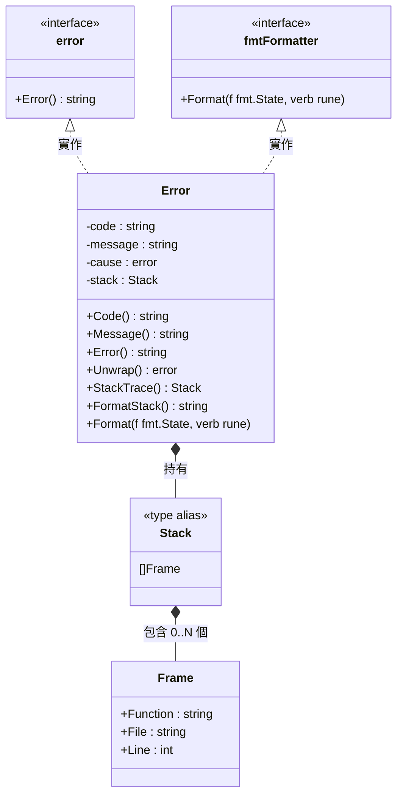
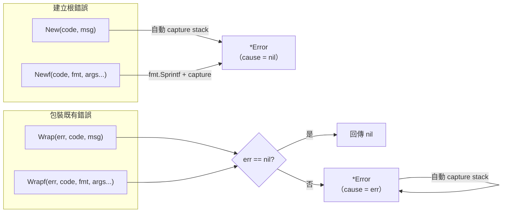
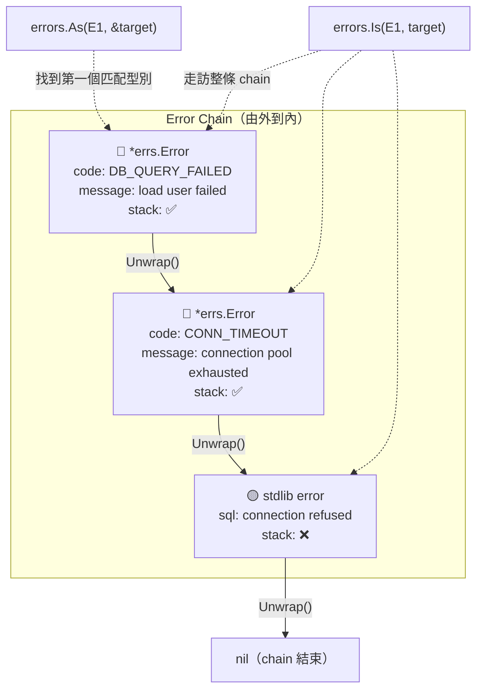
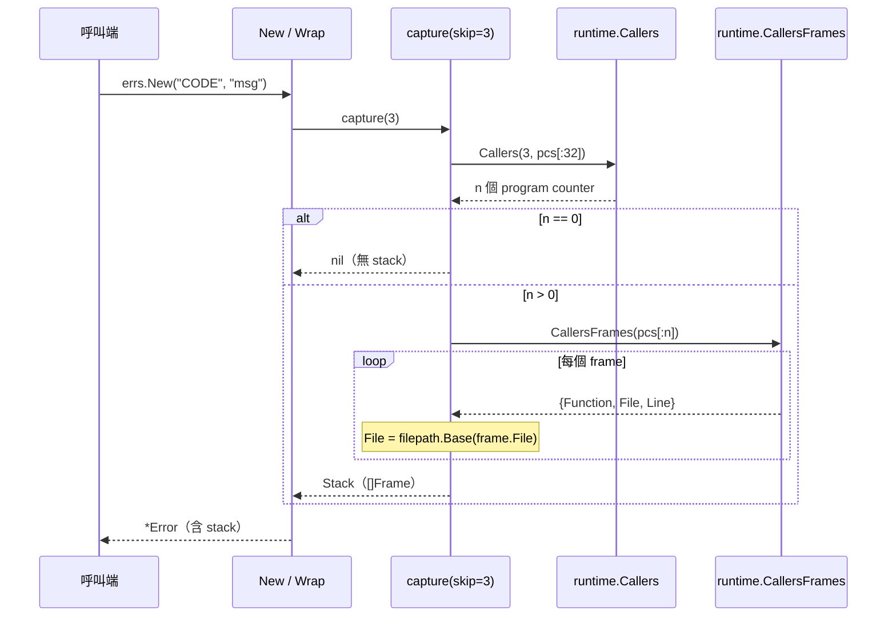
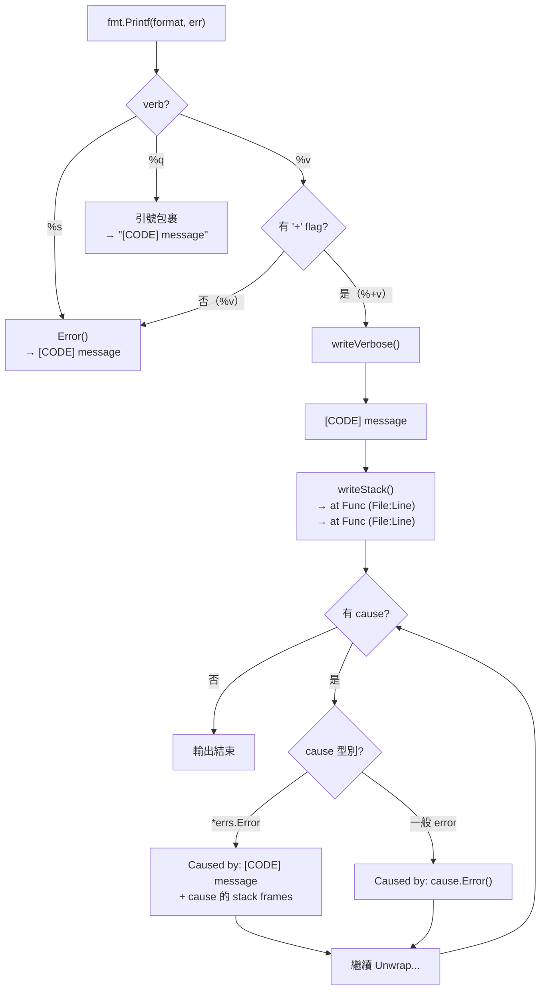
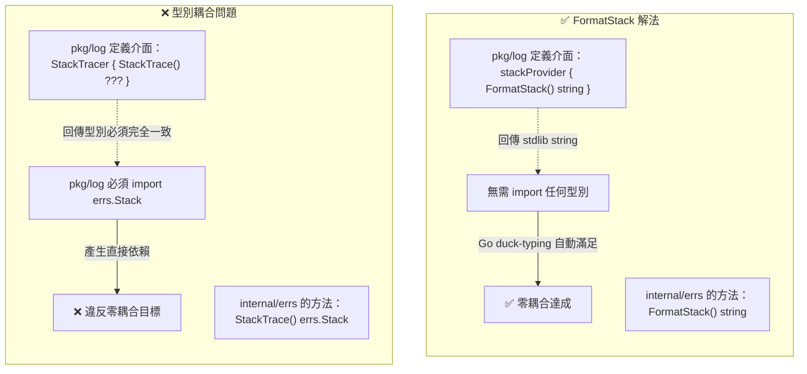
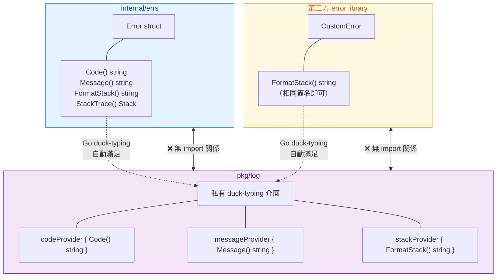

# `internal/errs` — 視覺化架構指南

## 快速導覽

- [Error 型別結構](#error-型別結構)
- [建立與包裝流程](#建立與包裝流程)
- [Error Chain 結構](#error-chain-結構)
- [Stack Trace 捕獲機制](#stack-trace-捕獲機制)
- [格式化輸出路由](#格式化輸出路由)
- [FormatStack 與 Duck-Typing](#formatstack-與-duck-typing)
- [跨模組零耦合架構](#跨模組零耦合架構)
- [使用情境決策樹](#使用情境決策樹)

---

## Error 型別結構

`Error` 結構體與其方法的完整面貌——包含實作的 interface 與對外提供的存取方式。

> **設計要點**：`Error` 的所有欄位皆為 unexported，只透過方法存取；`StackTrace()` 回傳防禦性複本，外部修改不影響原始值。

[返回開頭](#快速導覽)

---

## 建立與包裝流程

四個建構函式的輸入輸出與 `nil` 安全行為。

> **Nil Guard**：`Wrap(nil, ...)` / `Wrapf(nil, ...)` 安全回傳 `nil`，讓呼叫端可以直接 `return errs.Wrap(err, ...)` 而不需額外判斷。

[返回開頭](#快速導覽)

---

## Error Chain 結構

透過 `Wrap` 建立的 cause chain，與 stdlib `errors.Is` / `errors.As` 的走訪方式。

> **混合 chain**：chain 中可混合 `*errs.Error` 與一般 `error`。`%+v` 輸出時，`*errs.Error` 節點會印出 code + stack，一般 `error` 節點只印 message。

[返回開頭](#快速導覽)

---

## Stack Trace 捕獲機制

從呼叫端到最終存入 `Error.stack` 的完整路徑。

> **skip = 3** 的含義：跳過 `runtime.Callers` → `capture` → `New`/`Wrap`，使第一個 frame 指向**呼叫端**的程式碼位置。

[返回開頭](#快速導覽)

---

## 格式化輸出路由

`fmt.Formatter` 實作中，不同 verb 的輸出路由與最終格式。

> **Chain 走訪**：`%+v` 會沿著 `Unwrap()` 走訪整條 chain，每個節點根據型別決定輸出格式。

[返回開頭](#快速導覽)

---

## FormatStack 與 Duck-Typing

這是 `internal/errs` 最關鍵的設計決策之一——為什麼需要 `FormatStack()` 以及它如何實現零耦合。

### 問題：Go Interface 的型別耦合陷阱

### 三層偵測策略

`pkg/log` 從 `error` 中萃取結構化資訊時，依序嘗試三層偵測——不需要 import `internal/errs`。

```mermaid
flowchart TD
    Start["收到 error"]
    Start --> T1{"實作 FormatStack 嗎？"}

    T1 -->|"是"| FS["🎯 Tier 1：取得 stack 字串\nerr.FormatStack&#40;&#41;"]
    FS --> Code{"實作 Code 嗎？"}

    T1 -->|"否"| T2{"實作 fmt.Formatter 嗎？"}

    T2 -->|"是"| FMT["📋 Tier 2：嘗試 %+v\nfmt.Sprintf 取得詳細輸出"]
    FMT --> Code

    T2 -->|"否"| Plain["📝 Tier 3：純文字\nerr.Error&#40;&#41;"]
    Plain --> Code

    Code -->|"是"| Full["結構化日誌\ncode + message + stack"]
    Code -->|"否"| Partial["部分結構化\nerror.text + stack"]

    style FS fill:#d4edda,stroke:#28a745,color:#155724
    style FMT fill:#fff3cd,stroke:#ffc107,color:#856404
    style Plain fill:#f8d7da,stroke:#dc3545,color:#721c24
```

### 為什麼不只用 `StackTrace()`？

| 方法 | 回傳型別 | duck-typing 可行性 | 適用場景 |
|------|----------|-------------------|----------|
| `StackTrace()` | `errs.Stack`（自定義型別） | ❌ 消費端必須 import `internal/errs` | 程式內部需要逐 frame 存取時 |
| `FormatStack()` | `string`（stdlib 型別） | ✅ 任何模組可定義相同簽名 | 日誌、監控等只需文字表示時 |

> **共存設計**：兩個方法並存——`StackTrace()` 給需要結構化存取的場景，`FormatStack()` 給跨模組零耦合的場景。

[返回開頭](#快速導覽)

---

## 跨模組零耦合架構

`internal/errs` 與未來 `pkg/log` 之間的依賴關係——透過 duck-typing interface 達成完全解耦。

> **開放性**：任何 error library 只要實作 `FormatStack() string`，就能自動被 `pkg/log` 偵測並萃取 stack 資訊——不需要任何 import 或 registry。

[返回開頭](#快速導覽)

---

## 使用情境決策樹

在不同場景下，應該使用哪個 API。

```mermaid
flowchart TD
    Start["需要回傳 error"]
    Start --> HasCause{"有 cause\n（原始 error）嗎？"}

    HasCause -->|"否"| NeedFmt{"message 需要格式化嗎？"}
    NeedFmt -->|"否"| UseNew["errs.New&#40;code, msg&#41;"]
    NeedFmt -->|"是"| UseNewf["errs.Newf&#40;code, fmt, args...&#41;"]

    HasCause -->|"是"| CauseFmt{"message 需要格式化嗎？"}
    CauseFmt -->|"否"| UseWrap["errs.Wrap&#40;err, code, msg&#41;"]
    CauseFmt -->|"是"| UseWrapf["errs.Wrapf&#40;err, code, fmt, args...&#41;"]

    UseNew --> Return["return err\n型別為 error 介面"]
    UseNewf --> Return
    UseWrap --> Return
    UseWrapf --> Return

    Return --> Consumer{"消費端如何處理？"}

    Consumer -->|"判斷 error 類型"| ErrAs["errors.As&#40;err, &amp;target&#41;\n取得 *errs.Error"]
    Consumer -->|"判斷特定 cause"| ErrIs["errors.Is&#40;err, sentinel&#41;\n走訪 chain"]
    Consumer -->|"印出詳細資訊"| PrintV["fmt.Printf&#40;&quot;%+v&quot;, err&#41;\nJava-style stack trace"]
    Consumer -->|"傳給 log 系統"| LogSys["log.Error&#40;msg, err&#41;\n自動 duck-typing 萃取"]

    style UseNew fill:#d4edda,stroke:#28a745,color:#155724
    style UseNewf fill:#d4edda,stroke:#28a745,color:#155724
    style UseWrap fill:#d4edda,stroke:#28a745,color:#155724
    style UseWrapf fill:#d4edda,stroke:#28a745,color:#155724
    style Return fill:#fff3cd,stroke:#ffc107,color:#856404
```

[返回開頭](#快速導覽)
