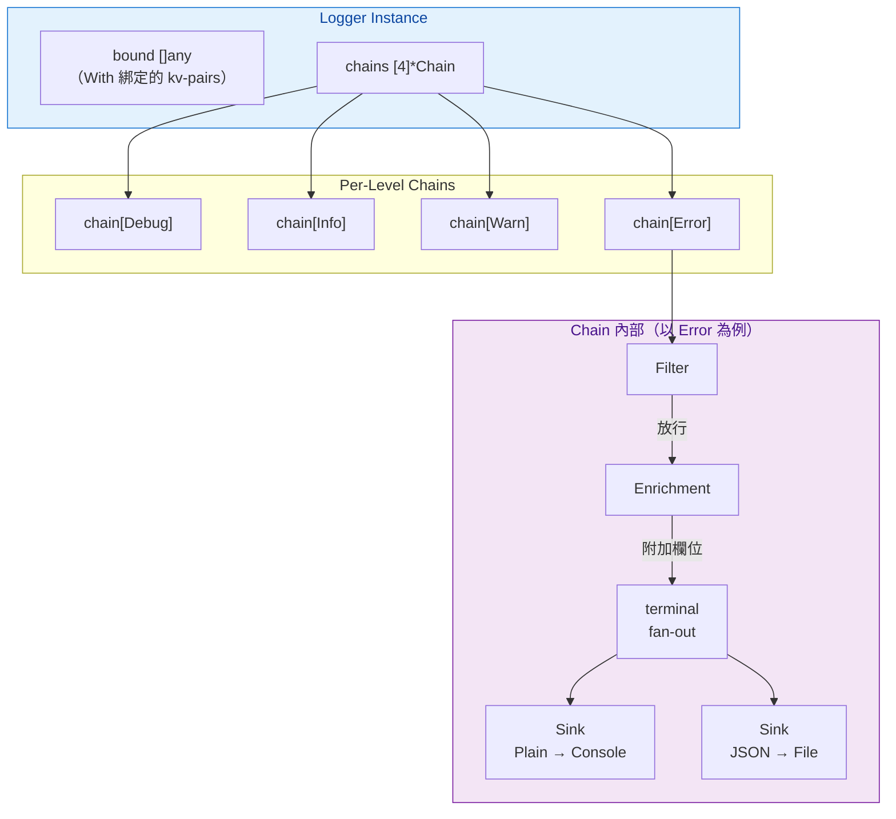
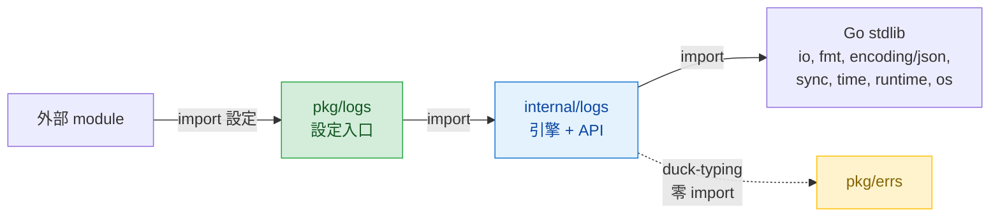

# `internal/logs` + `pkg/logs` — Logging 模組設計規格

## 快速導覽

- [問題與目標](#問題與目標)
- [設計決策紀錄](#設計決策紀錄)
- [架構總覽](#架構總覽)
- [Entry 與 Level](#entry-與-level)
- [Handler Chain 機制](#handler-chain-機制)
- [Sink — Formatter + Writer](#sink--formatter--writer)
- [PlainFormatter 格式規格](#plainformatter-格式規格)
- [JSONFormatter 格式規格](#jsonformatter-格式規格)
- [Error Duck-Typing 偵測](#error-duck-typing-偵測)
- [四個維度](#四個維度)
- [Logger 結構與 API](#logger-結構與-api)
- [pkg/logs 設定 API](#pkglogs-設定-api)
- [RotatingFileWriter](#rotatingfilewriter)
- [Internal Warn 機制](#internal-warn-機制)
- [Package 結構與檔案清單](#package-結構與檔案清單)
- [測試與驗收標準](#測試與驗收標準)
- [未來擴充：Buffered / Async Writer](#未來擴充buffered--async-writer)
- [風險與待確認事項](#風險與待確認事項)

---

## 問題與目標

專案目前只有極簡的 [`pkg/logger/logger.go`](../pkg/logger/logger.go)（僅 `Info` / `Error` 兩個 wrapper），全 codebase 零 import，無 logging 基礎設施。

**目標**：建立以 decorator pattern 為核心的自建 logging 模組，支援 per-level 獨立 decorator chain、全 lazy closure API、結構化 kv-pair 輸出，以及透過 duck-typing 零耦合偵測 [`pkg/errs`](../pkg/errs/errs.go) 的結構化欄位。

| 目標 | 說明 |
|------|------|
| Per-level 獨立 decorator chain | 4 個 level 各自擁有完全獨立的 Filter → Enrichment → Sink 組合 |
| 全 lazy closure API | 所有 log func 接受 closure，level 未啟用時 closure 不執行，zero allocation |
| Decorator pattern | Handler chain 以裝飾器模式串接，支援 Filter / Enrichment / Formatter / Output 四個維度 |
| 結構化 kv-pair 輸出 | Plain 格式帶編號排版，JSON 格式帶 key 衝突保護與型別保真 |
| Error 智慧偵測 | 以 duck-typing 偵測 `Code()` / `Message()` / `FormatStack()`，零跨模組耦合 |
| 零外部依賴 | 模組本體只使用 Go stdlib（測試允許引入 `testify`） |

### 不包含

- 不改寫 `internal/handler`、`internal/service`、`internal/repository`（後續另案推廣）
- 不引入外部 logging library（zap、logrus 等）
- 不實作 async flush / buffered writer（屬進階議題）

[返回開頭](#快速導覽)

---

## 設計決策紀錄

| # | 議題 | 決策 | 理由 |
|---|------|------|------|
| D1 | 底層引擎 | 完全自建，不基於 `log/slog` | slog 的設計模型與 per-level 獨立 chain、全 lazy closure API、自訂 kv-pair 格式根本衝突；硬套 slog 等於在上面蓋一層幾乎完全覆寫的 wrapper，benefit 趨近於零 |
| D2 | API 風格 | 全 lazy closure，無 eager variant | Go variadic `...any` 在 call site 就 allocate slice；closure 包裝後 level disabled 時完全不執行，zero allocation |
| D3 | 模組位置 | `internal/logs`（引擎 + API）+ `pkg/logs`（設定入口） | Monorepo 場景：其他 module 可 import 設定 API 但不能碰實作細節 |
| D4 | Per-level 設定 | 4 個 level 各自持有獨立 `Chain`，支援完全不同的 decorator 組合 | 類似 Java SLF4J / Logback 的 Appender 概念，每個 level 可以有不同的 format × output 組合 |
| D5 | Decorator chain | 單一 `Handler` interface + `next` 串接 | 所有維度實作同一個 interface，串接順序由使用者控制，新增維度只需實作 `Handler` |
| D6 | Error 處理 | duck-typing 偵測，不 import `pkg/errs` | `FormatStack() string` 回傳 stdlib 型別，任何 error library 只需實作同簽名方法即可相容 |
| D7 | Log func 回傳值 | 不回傳 error，fire-and-forget | Log 系統回傳 error 呼叫端無法處理，內部消化所有失敗並 fallback |
| D8 | With-error variant 命名 | `InfoWith` / `DebugWith` / `WarnWith` / `ErrorWith` | `With` suffix 語意清晰，避免 `ErrorErr` 的尷尬 |
| D9 | nil closure | 允許 `logs.Info("msg", nil)` 代表無 kv-pairs | 避免純 message log 必須寫 `func() []any { return nil }` 的冗長 |
| D10 | Console output 路由 | Debug+Info → stdout，Warn+Error → stderr | 標準 Unix 慣例，stdout 給正常輸出，stderr 給警告/錯誤 |
| D11 | 全局預設值 | 零設定即可用：全 level 啟用、Plain + Console、帶 Caller enrichment | 避免「忘了設定就什麼都看不到」 |
| D12 | Internal warn | 走自身系統的 `Warn`，帶遞迴保護，最終 fallback stderr | 自己吃自己的 dog food；遞迴保護避免無限迴圈 |

[返回開頭](#快速導覽)

---

## 架構總覽

Logger instance 持有 4 條獨立的 Handler chain，每條 chain 由 Filter → Enrichment → Sink(s) 組成。`With()` 產生新 instance 共享 chain 但各自持有 bound kv-pairs。



### 依賴方向



[返回開頭](#快速導覽)

---

## Entry 與 Level

### Level

```go
type Level int8

const (
    LevelDebug Level = iota
    LevelInfo
    LevelWarn
    LevelError
)
```

`int8` 只有 4 個值，省記憶體且比較更快。提供 `String()` 方法（`"DEBUG"`, `"INFO"`, `"WARN"`, `"ERROR"`）供 formatter 使用。

### Entry

```go
type Entry struct {
    Time     time.Time
    Level    Level
    Message  string
    Args     []any    // kv-pairs（lazy closure 的回傳值）
    Error    error    // WithXxx variant 的 error，一般 variant 為 nil
    Bound    []any    // With() 綁定的 kv-pairs（由 Logger 注入）
    internal bool     // internal warn 標記，用於遞迴保護（unexported）
}
```

| 欄位 | 說明 |
|------|------|
| `Args` / `Bound` 分開存放 | Formatter 需要區分「預綁定」和「本次呼叫」的 kv-pairs；合併順序：`Bound` 先、`Args` 後，共用同一個計數器 |
| `Error` 獨立欄位 | Error 需要走 duck-typing 偵測（code/msg/stack），跟普通 kv-pair 路徑不同 |
| `Time` 在 chain 入口捕獲 | 同一筆 entry 在多個 Sink fan-out 時 timestamp 一致 |
| `internal` 標記 | 用於 [Internal Warn 機制](#internal-warn-機制) 的遞迴保護，外部不可見 |

[返回開頭](#快速導覽)

---

## Handler Chain 機制

### Handler Interface

```go
type Handler interface {
    Handle(entry Entry, next func(Entry))
}
```

不回傳 error——logging 系統內部消化所有失敗（參見 [Internal Warn 機制](#internal-warn-機制)）。

每個 Handler 可以：
- **放行**：呼叫 `next(entry)` 繼續往下（Filter 通過時）
- **攔截**：不呼叫 `next`，直接 return（Filter 不通過時）
- **修改**：改 entry 後再呼叫 `next(modified)`（Enrichment）

### Chain 結構

```go
type Chain struct {
    handlers []Handler
    terminal func(Entry)  // fan-out 到多個 Sink
}
```

### 執行流程

```mermaid
flowchart LR
    exec["chain.Execute&#40;entry&#41;"]
    h0["handlers[0].Handle"]
    h1["handlers[1].Handle"]
    hN["handlers[N].Handle"]
    term["terminal&#40;entry&#41;<br/>fan-out 到所有 Sink"]

    exec --> h0 -->|"next&#40;&#41;"| h1 -->|"next&#40;&#41;"| hN -->|"next&#40;&#41;"| term
```



遞迴透過 closure 串接，chain 建構時一次性組裝 `next` closure，執行時是純 function call，不需額外 slice allocation。

### Per-Level Chain 組裝

```go
type levelConfig struct {
    handlers []Handler  // Filter → Enrichment 等
    sinks    []Sink     // 每個 sink = Formatter + Writer
}
```

4 個 level 各自持有一個 `levelConfig`，完全獨立。

[返回開頭](#快速導覽)

---

## Sink — Formatter + Writer

Sink 是 chain 的 terminal node，負責 format + write。一個 level 可以掛多個 Sink（fan-out）。

```go
type Sink struct {
    formatter Formatter
    writer    io.Writer
}

func (s *Sink) Write(entry Entry) {
    data, err := s.formatter.Format(entry)
    if err != nil {
        s.fallback("format failed", err, entry)
        return
    }
    if _, err := s.writer.Write(data); err != nil {
        s.fallback("write failed", err, entry)
    }
}
```

失敗時走 [Internal Warn 機制](#internal-warn-機制)。

### Formatter Interface

```go
type Formatter interface {
    Format(entry Entry) ([]byte, error)
}
```

兩個內建實作：`PlainFormatter` 和 `JSONFormatter`。

[返回開頭](#快速導覽)

---

## PlainFormatter 格式規格

### 基本格式

```
yymmdd HH:mm:ss.SSS [%-5s] message
  (index) key : value
  ...
```

- Timestamp：預設 `yymmdd HH:mm:ss.SSS`（local time），可透過 `Plain(WithTimeFormat(...))` 自訂
- Level：`fmt.Sprintf("%-5s", level)` 固定 5 字元靠左
- kv-pairs 每組一行，`Bound` 先輸出、`Args` 接在後面，共用同一個計數器

### 編號規則

- 無 error → 寬度由 args 數量決定（`fmt.Sprintf("%0*d", width, i)`）
- **有 error → 寬度固定 5**，對齊 `(error)`

### 無 error 範例

```
240328 14:05:23.456 [INFO ] user logged in
  (1) request_id : abc-123
  (2) user_id    : 42
```

### 有 error 範例

```
240328 14:05:23.456 [ERROR] query failed
  (    1) table : users
  (    2) id    : 42
  (error) [DB_TIMEOUT] connection pool exhausted
    at service.LoadUser (service.go:42)
    at handler.GetUser (handler.go:18)
```

### Error 區塊規則

- 有 `Code()` → `[CODE] msg`
- 無 `Code()` → 直接印 msg（fallback `err.Error()`）
- 有 `FormatStack()` → 每行縮排 `    at ...`
- 有 `fmt.Formatter` 但無 `FormatStack()` → 印 `%+v` 結果
- 都沒有 → 不印 stack 區塊

### Key 對齊

找到最長 key 後統一靠左對齊，`:` 對齊。

[返回開頭](#快速導覽)

---

## JSONFormatter 格式規格

### 基本格式

```json
{
  "time": "2026-03-28T14:05:23.456Z",
  "level": "ERROR",
  "msg": "query failed",
  "table": "users",
  "err_code": "DB_TIMEOUT",
  "err_msg": "connection pool exhausted",
  "err_stack": "service.LoadUser (service.go:42)\nhandler.GetUser (handler.go:18)"
}
```

- Timestamp：預設 ISO 8601 UTC（`time.RFC3339Milli` = `2006-01-02T15:04:05.000Z07:00`），可透過 `JSON(WithTimeFormat(...))` 自訂

### kv-pairs 規則

- `Bound` 先、`Args` 後，平鋪進 JSON object
- **key 衝突不覆蓋**——重複 key 加 `_2`、`_3` suffix，並觸發 internal warn log

### Error 固定欄位

| 欄位 | 來源 | 無資料時 |
|------|------|---------|
| `err_code` | `Code()` | `null` |
| `err_msg` | `Message()`，fallback `err.Error()` | 一定有值 |
| `err_stack` | `FormatStack()`，fallback `fmt.Sprintf("%+v", err)` | `null` |

三個 key **一定存在**，不會省略。

### Value 型別處理

| value 型別 | 輸出方式 |
|-----------|---------|
| `string` | JSON string |
| 數字型別（`int*`, `float*`, `uint*`） | JSON number，保持原型態 |
| `json.RawMessage` | **先 `json.Valid()` 驗證**，合法則直接嵌入；不合法降級為 JSON string + internal warn log |
| `json.Marshaler` 實作者 | 呼叫 `MarshalJSON()`，**先 `json.Valid()` 驗證**，合法則嵌入；不合法降級為 `fmt.Sprintf("%+v")` → JSON string + internal warn log |
| 其他 | `fmt.Sprintf("%+v")` → JSON string |

### Args 不為偶數

用參數 index 當 key（`"_arg0"`, `"_arg1"`, ...），同時觸發 internal warn log。

[返回開頭](#快速導覽)

---

## Error Duck-Typing 偵測

`internal/logs` **不 import `pkg/errs`**。所有結構化欄位偵測皆透過未匯出的 duck-typing 介面。

### 偵測介面

```go
type codeProvider interface {
    Code() string
}

type messageProvider interface {
    Message() string
}

type stackProvider interface {
    FormatStack() string
}
```

### 偵測流程

```mermaid
flowchart TD
    Start["收到 entry.Error"]

    Start --> MP{"實作 messageProvider？"}
    MP -->|"是"| MsgMethod["err_msg = Message&#40;&#41;"]
    MP -->|"否"| MsgFallback["err_msg = err.Error&#40;&#41;"]

    MsgMethod --> CP{"實作 codeProvider？"}
    MsgFallback --> CP

    CP -->|"是"| CodeMethod["err_code = Code&#40;&#41;"]
    CP -->|"否"| CodeNull["err_code = 空字串"]

    CodeMethod --> SP{"實作 stackProvider？"}
    CodeNull --> SP

    SP -->|"是"| StackMethod["err_stack = FormatStack&#40;&#41;"]
    SP -->|"否"| FmtCheck{"實作 fmt.Formatter？"}

    FmtCheck -->|"是"| FmtFallback["err_stack = fmt.Sprintf&#40;&quot;%+v&quot;, err&#41;"]
    FmtCheck -->|"否"| StackNull["err_stack = 空字串"]

    StackMethod --> Done["完成偵測"]
    FmtFallback --> Done
    StackNull --> Done

    style StackMethod fill:#d4edda,stroke:#28a745,color:#155724
    style FmtFallback fill:#fff3cd,stroke:#ffc107,color:#856404
    style StackNull fill:#f8d7da,stroke:#dc3545,color:#721c24
```



### 與 [pkg/errs](../docs/errs.md) 的相容性

`*errs.Error` 同時實作 `Code() string`、`Message() string`、`FormatStack() string`，自動滿足所有三個 duck-typing 介面。任何第三方 error library 只需實作相同簽名方法即可相容。

[返回開頭](#快速導覽)

---

## 四個維度

### Filter

```go
type KeyFilter struct {
    key   string
    match func(string) bool
}

type MessageFilter struct {
    match func(string) bool
}
```

- `FilterByKey(key, fn)` — kv-pairs 中指定 key 的 value 符合 `fn` 才放行
- `FilterByMessage(fn)` — message 符合 `fn` 才放行
- `match` 是 `func(string) bool`，呼叫端自由選擇判斷方式（完全相等、prefix、regexp 等）
- 多個 Filter 串接時是 AND 關係（全部通過才放行）

```go
// 完全相等 — 零 overhead
logs.FilterByKey("env", func(v string) bool { return v == "prod" })

// regexp — 需要時才用
logs.FilterByMessage(regexp.MustCompile(`timeout`).MatchString)
```

### Enrichment

| Enricher | 附加的 kv-pair | 說明 |
|----------|-------------|------|
| `Caller()` | `"caller"`, `"service.go:42"` | `runtime.Caller` 取單一呼叫位置（零 slice allocation）；**預設啟用** |
| `Static(k, v)` | 任意 key-value | 固定附加，例如 `"service"`, `"api-gateway"` |

- Enricher 注入的 kv-pairs 加到 `entry.Bound` **前面**——優先級最低，不覆蓋 `With()` 綁定和本次呼叫的 args
- 不想要 Caller 可用 `NoCaller()` 明確移除

### Formatter

`PlainFormatter` 與 `JSONFormatter`，詳見 [PlainFormatter 格式規格](#plainformatter-格式規格) 與 [JSONFormatter 格式規格](#jsonformatter-格式規格)。

### Output

| 函式 | 行為 | 說明 |
|------|------|------|
| `ToConsole()` | Debug+Info → `os.Stdout`，Warn+Error → `os.Stderr` | 智慧預設 |
| `ToStdout()` | 一律 `os.Stdout` | 明確指定 |
| `ToStderr()` | 一律 `os.Stderr` | 明確指定 |
| `ToWriter(w)` | 一律 `w` | 外部接管模式 |
| `ToFile(name, cfg)` | `RotatingFileWriter` | 獨立運作模式，內建 rotation |

Output 實作 `Output` interface：

```go
type ResolveContext struct {
    Level Level
}

type Output interface {
    Resolve(ctx ResolveContext) io.Writer
}
```

`ResolveContext` 使用 struct 傳參——未來擴充欄位不需修改 interface 簽名。

[返回開頭](#快速導覽)

---

## Logger 結構與 API

### Logger struct

```go
type Logger struct {
    bound  []any       // With() 累積的 kv-pairs
    chains [4]*Chain   // index = Level（Debug=0, Info=1, Warn=2, Error=3）
}
```

- `chains` 是共享指標——`With()` 產生的新 Logger 與原本的指向同一組 chain，只有 `bound` 不同
- Package-level 有預設 `defaultLogger *Logger`

### With()

```go
func (l *Logger) With(args ...any) *Logger {
    merged := make([]any, len(l.bound)+len(args))
    copy(merged, l.bound)
    copy(merged[len(l.bound):], args)
    return &Logger{
        bound:  merged,
        chains: l.chains,  // 共享，不複製
    }
}
```

`With()` 是 eager——綁定的 context 在建立時已知，不需要 lazy。支援鏈式呼叫。

### Log Functions

```go
// kv-only variant
func (l *Logger) Info(msg string, fn func() []any) {
    chain := l.chains[LevelInfo]
    if chain == nil {
        return
    }
    var args []any
    if fn != nil {
        args = fn()
    }
    chain.Execute(Entry{
        Time:    time.Now(),
        Level:   LevelInfo,
        Message: msg,
        Args:    args,
        Bound:   l.bound,
    })
}

// with-error variant
func (l *Logger) InfoWith(msg string, fn func() (error, []any)) {
    chain := l.chains[LevelInfo]
    if chain == nil {
        return
    }
    var (
        err  error
        args []any
    )
    if fn != nil {
        err, args = fn()
    }
    chain.Execute(Entry{
        Time:    time.Now(),
        Level:   LevelInfo,
        Message: msg,
        Args:    args,
        Error:   err,
        Bound:   l.bound,
    })
}
```

**Lazy 門檻：`chain == nil`**——level 未設定任何輸出時，closure 不執行，zero allocation。

### 完整 API 列表

| 方法 | 簽名 |
|------|------|
| `Debug` | `(msg string, fn func() []any)` |
| `DebugWith` | `(msg string, fn func() (error, []any))` |
| `Info` | `(msg string, fn func() []any)` |
| `InfoWith` | `(msg string, fn func() (error, []any))` |
| `Warn` | `(msg string, fn func() []any)` |
| `WarnWith` | `(msg string, fn func() (error, []any))` |
| `Error` | `(msg string, fn func() []any)` |
| `ErrorWith` | `(msg string, fn func() (error, []any))` |
| `With` | `(args ...any) *Logger` |

所有方法同時有 package-level 便利函式版本（透過 `defaultLogger` 委派）。

### 使用範例

```go
// 純 message
logs.Info("server started", nil)

// 帶 kv-pairs
logs.Info("user login", func() []any {
    return []any{"user_id", uid, "ip", remoteAddr}
})

// 帶 error
logs.ErrorWith("query failed", func() (error, []any) {
    return err, []any{"table", "users"}
})

// With 綁定
l := logs.With("request_id", rid, "method", "GET")
l.Info("handling request", nil)
l.ErrorWith("failed", func() (error, []any) { return err, nil })
```

[返回開頭](#快速導覽)

---

## pkg/logs 設定 API

### Configure

```go
package logs

// Configure 設定 internal/logs 的輸出行為。
// 內部使用 sync.Once 保護，僅首次呼叫生效，後續呼叫為 no-op。
func Configure(opts ...Option)
```

### 全局預設值（零設定即可用）

| 項目 | 預設值 |
|------|--------|
| Level | 全部 4 個 level 都啟用 |
| Formatter | Plain |
| Output | Console（Debug+Info → stdout, Warn+Error → stderr） |
| Enrichment | Caller() |

不呼叫 `Configure()` 等同於：

```go
logs.Configure(
    logs.WithEnrichment(logs.Caller()),
    logs.Pipe(logs.Plain(), logs.ToConsole()),
)
```

### 設定 DSL

```go
logs.Configure(
    // 全局設定 — 套用到所有 level 作為 base
    logs.WithFilter(logs.FilterByMessage(func(m string) bool { return m != "heartbeat" })),
    logs.Pipe(logs.Plain(), logs.ToConsole()),

    // 個別 level 追加設定
    logs.ForInfo(
        logs.Pipe(logs.JSON(), logs.ToFile("app", logs.RotateConfig{MaxSize: 100 << 20})),
    ),
    logs.ForError(
        logs.WithEnrichment(logs.Static("service", "api")),
        logs.Pipe(logs.JSON(), logs.ToFile("error", logs.RotateConfig{})),
    ),
)
```

### 合併規則

- 全局設定作為 base，每個 level 繼承
- `ForXxx()` 的設定 **追加** 到全局之上（不是覆寫）
- `Caller()` 預設啟用；如果某個 level 不需要，用 `NoCaller()` 明確移除
- `NoInherit()` 可讓某個 level 完全不繼承全局設定

### Builder Functions

```go
// Level 選擇
func ForDebug(opts ...Option) Option
func ForInfo(opts ...Option) Option
func ForWarn(opts ...Option) Option
func ForError(opts ...Option) Option

// Decorator 層
func WithFilter(f ...Filter) Option
func WithEnrichment(e ...Enricher) Option
func NoInherit() Option

// Sink 層
func Pipe(fmt Formatter, out Output) Option

// Formatter（接受 FormatterOption 自訂 time format 等）
func Plain(opts ...FormatterOption) Formatter
func JSON(opts ...FormatterOption) Formatter

// Formatter options
func WithTimeFormat(layout string) FormatterOption  // Go time layout string

// Output
func ToConsole() Output
func ToStdout() Output
func ToStderr() Output
func ToWriter(w io.Writer) Output
func ToFile(name string, cfg RotateConfig) Output

// Filter builder
func FilterByKey(key string, match func(string) bool) Filter
func FilterByMessage(match func(string) bool) Filter

// Enricher builder
func Caller() Enricher
func Static(key string, value any) Enricher
func NoCaller() Enricher
```

### pkg/logs → internal/logs 橋接

```
pkg/logs.Configure()
  → 解析全局 Option + per-level Option
  → 合併（全局 base + level 追加）
  → 建構 []Handler + []Sink per level
  → 組裝 Chain
  → 設定 internal/logs.defaultLogger.chains[level]
```

`pkg/logs` import `internal/logs`，反向不 import。

[返回開頭](#快速導覽)

---

## RotatingFileWriter

放在 `pkg/logs`，外部 module 也可獨立使用。

### RotateConfig

```go
type RotateConfig struct {
    MaxSize    int64  // 單檔上限 bytes，預設 100MB
    MaxBackups int    // 保留舊檔數量，預設 10
    MaxAge     int    // 保留天數，預設 7，0 = 不限
    Compress   bool   // 舊檔 gzip 壓縮
}
```

### 檔名規則

副檔名跟隨 Formatter 型別：
- Plain → `app.log` → rotate 後 `app.20260328-140523.log`
- JSON → `app.json` → rotate 後 `app.20260328-140523.json`

### 寫入與 Rotation 流程

```
write(data)
  → 檢查 size 是否超過 MaxSize
    → 沒超過：直接寫，結束
    → 超過：觸發 rotation
      1. close 舊檔
      2. rename → {name}.{timestamp}.{ext}
      3. open 新檔
      4. 寫入
      5. 背景 goroutine 清理舊檔
         - 檢查 backups 數量 + age，超過的刪除
         - 需要壓縮的在此排程
```

- **清理只在 rotation 事件時觸發**，不是每筆寫入都檢查
- 清理與壓縮在背景 goroutine 執行，不阻塞當次寫入
- 正常寫入的 hot path 只有一個 size 比較
- `sync.Mutex` 保護 file handle，寫入是同步的
- 純 stdlib 實作（`os.File` + `sync.Mutex` + rename），零外部依賴

[返回開頭](#快速導覽)

---

## Internal Warn 機制

當模組內部發生異常（奇數 args、key 衝突、`json.RawMessage` 格式錯誤、Sink 寫入失敗），統一走自身系統的 `Warn` log。

### 遞迴保護

Entry 帶有 `internal` 標記。流程：

1. 異常發生 → 建立 `Entry{internal: true}` → 走 Warn chain
2. 如果這筆 internal entry 的處理過程又發生異常 → 偵測到 `internal: true` → **fallback 到 `fmt.Fprintf(os.Stderr, ...)`**，不再遞迴

這確保最多兩層：正常 → internal warn → stderr，永遠不會無限迴圈。

[返回開頭](#快速導覽)

---

## Package 結構與檔案清單

```
pkg/logs/                     ← 外部可 import（設定入口）
├── config.go                 ← Configure()、Option、LevelOption、builder funcs
├── output.go                 ← Output interface、ResolveContext、ToConsole/ToStdout/ToStderr/ToWriter/ToFile
├── rotate.go                 ← RotatingFileWriter、RotateConfig
├── filter.go                 ← Filter type、FilterByKey/FilterByMessage
├── enrichment.go             ← Enricher type、Caller/Static/NoCaller
└── formatter.go              ← Formatter interface、Plain()/JSON() builder

internal/logs/                ← 本專案內部使用（引擎 + API）
├── entry.go                  ← Entry struct、Level enum
├── handler.go                ← Handler interface、Chain struct、chain 組裝
├── sink.go                   ← Sink struct、fallback 機制
├── format_plain.go           ← PlainFormatter 實作
├── format_json.go            ← JSONFormatter 實作
├── detect.go                 ← duck-typing 偵測介面與 extractError()
├── logger.go                 ← Logger struct、With()、Debug/Info/Warn/Error/DebugWith/...
├── logs.go                   ← defaultLogger、package-level 便利函式、Init()
└── internal_warn.go          ← 遞迴保護 + stderr fallback
```

### 影響既有檔案

| 操作 | 檔案 | 說明 |
|------|------|------|
| 刪除 | [`pkg/logger/logger.go`](../pkg/logger/logger.go) | 舊 logger，已確認零 import |
| 刪除 | [`docs-plan/log-plan.md`](../docs-plan/log-plan.md) | 舊計畫，由本 spec 取代 |

[返回開頭](#快速導覽)

---

## 測試與驗收標準

### internal/logs 驗收

| # | 驗收項目 | 測試方式 | 預期結果 |
|---|---------|---------|---------|
| L1 | 零設定即可用 | unit test | 不呼叫 `Configure()`，`logs.Info()` 正常輸出到 stdout |
| L2 | Per-level chain 獨立 | unit test | Debug 設定 plain+console，Error 設定 json+file，輸出互不干擾 |
| L3 | Lazy closure：chain nil 時不執行 | unit test | closure 內設 flag，level 未設定時 flag 未觸發 |
| L4 | Lazy closure：chain 存在時正常執行 | unit test | log 輸出含 closure 回傳的 kv-pairs |
| L5 | nil closure = 無 kv-pairs | unit test | `logs.Info("msg", nil)` 正常輸出，無 panic |
| L6 | `With()` 綁定 kv-pairs 傳遞 | unit test | 綁定的 kv-pairs 出現在所有後續 log 輸出 |
| L7 | `With()` 鏈式呼叫 | unit test | `.With("a", 1).With("b", 2)` 兩組 kv-pairs 都出現 |
| L8 | `With()` 不影響原始 Logger | unit test | 衍生 logger 的 bound 不回寫到原始 logger |
| L9 | `InfoWith` 等帶 error 的 variant | unit test | entry.Error 正確傳遞，formatter 正確輸出 error 區塊 |
| L10 | Console output 路由 | unit test | Debug+Info 寫到 stdout，Warn+Error 寫到 stderr |
| L11 | Fan-out 多個 Sink | unit test | 同一筆 log 同時出現在所有已註冊的 writer |

### PlainFormatter 驗收

| # | 驗收項目 | 測試方式 | 預期結果 |
|---|---------|---------|---------|
| P1 | 基本格式正確 | unit test | timestamp + level + message + kv-pairs 排版正確 |
| P2 | 無 error 時編號寬度由 args 數量決定 | unit test | 1-9 個 args 寬度 1，10+ 寬度 2 |
| P3 | 有 error 時編號寬度固定 5 對齊 `(error)` | unit test | `(    1)` ... `(error)` 對齊 |
| P4 | Key 對齊 | unit test | 所有 key 靠左對齊，`:` 對齊 |
| P5 | Error 有 code + stack | unit test | `(error) [CODE] msg` + stack trace |
| P6 | Error 無 code 無 stack | unit test | `(error) err.Error()` 無 stack 區塊 |
| P7 | Error 有 fmt.Formatter fallback | unit test | 無 `FormatStack()` 但有 `fmt.Formatter` 時印 `%+v` |

### JSONFormatter 驗收

| # | 驗收項目 | 測試方式 | 預期結果 |
|---|---------|---------|---------|
| J1 | 基本 JSON 結構 | unit test | 合法 JSON，含 time/level/msg |
| J2 | kv-pairs 平鋪 | unit test | Bound 先、Args 後，正確出現在 JSON |
| J3 | Key 衝突不覆蓋 | unit test | 重複 key 加 `_2` suffix + internal warn |
| J4 | Error 三欄位一定存在 | unit test | `err_code`/`err_msg`/`err_stack` 皆出現，無資料時為 `null` |
| J5 | `err_msg` fallback | unit test | 無 `Message()` 時用 `err.Error()` |
| J6 | 數字保持原型態 | unit test | `int` → JSON number，非 string |
| J7 | `json.RawMessage` 合法時直接嵌入 | unit test | 嵌入的 JSON 結構完整 |
| J8 | `json.RawMessage` 不合法時降級 | unit test | 降級為 string + internal warn |
| J9 | Args 奇數時用 index 當 key | unit test | `"_arg0"` 等出現 + internal warn |

### Filter / Enrichment 驗收

| # | 驗收項目 | 測試方式 | 預期結果 |
|---|---------|---------|---------|
| F1 | FilterByMessage 攔截 | unit test | 不符合的 message 不輸出 |
| F2 | FilterByKey 攔截 | unit test | 不符合的 kv value 不輸出 |
| F3 | 多 Filter AND 關係 | unit test | 任一不通過則不輸出 |
| E1 | Caller enrichment | unit test | 輸出含 `caller` 欄位，值為正確的檔名:行號 |
| E2 | Static enrichment | unit test | 輸出含固定 kv-pair |
| E3 | NoCaller 移除預設 Caller | unit test | 輸出不含 `caller` 欄位 |
| E4 | Enricher 優先級最低 | unit test | With 綁定的同名 key 覆蓋 Enricher 注入的 |

### RotatingFileWriter 驗收

| # | 驗收項目 | 測試方式 | 預期結果 |
|---|---------|---------|---------|
| R1 | Size-based rotation | unit test | 超過 MaxSize 時產生新檔 |
| R2 | 檔名副檔名跟隨 format | unit test | plain → `.log`，json → `.json` |
| R3 | MaxBackups 清理 | unit test | 超過上限的舊檔被刪除 |
| R4 | MaxAge 清理 | unit test | 超過天數的舊檔被刪除 |
| R5 | 清理只在 rotation 時觸發 | unit test | 正常寫入不觸發清理邏輯 |
| R6 | Compress | unit test | 舊檔被 gzip 壓縮 |

### pkg/logs 設定驗收

| # | 驗收項目 | 測試方式 | 預期結果 |
|---|---------|---------|---------|
| C1 | 全局設定套用到所有 level | unit test | 全局 Pipe 在 4 個 level 都生效 |
| C2 | ForXxx 追加到全局 | unit test | 全局 + level 設定合併，非覆寫 |
| C3 | NoInherit 不繼承全局 | unit test | 該 level 只有自己的設定 |
| C4 | Caller 預設啟用 | unit test | 不設定 enrichment 時仍有 caller |
| C5 | NoCaller 移除預設 | unit test | 該 level 無 caller |

### 整合驗收

| # | 驗收項目 | 指令 | 預期結果 |
|---|---------|------|---------|
| I1 | 全專案編譯 | `go build ./...` | 零錯誤 |
| I2 | 全測試通過 | `go test ./... -v` | 全部 PASS |
| I3 | 靜態分析 | `go vet ./...` | 零警告 |
| I4 | 舊 logger 已移除 | `grep -r "pkg/logger" --include="*.go"` | 零匹配 |

[返回開頭](#快速導覽)

---

## 未來擴充：Buffered / Async Writer

第一版使用同步寫入（unbuffered）——每筆 log 直接呼叫 `io.Writer.Write()`，寫完才 return。此章節記錄不納入第一版的理由與未來擴充路徑。

### 為什麼第一版不實作

**Buffered Writer**（累積到記憶體 buffer，滿了才 flush）：
- 優點：減少 syscall 次數（batching），高頻場景吞吐量更好
- 代價：crash 時 buffer 裡的資料遺失；需要 flush 機制（定時 / 手動 / shutdown hook）；多 goroutine 寫入需額外的 lock 或 channel 管理

**Async Writer**（呼叫端只丟 entry 進 channel，背景 goroutine 負責寫入）：
- 優點：呼叫端幾乎 zero latency，不被 I/O 阻塞
- 代價：同樣有遺失風險；channel 滿時的策略（block / drop / backpressure）增加決策複雜度；需要 graceful shutdown 確保 drain；log 順序可能與實際執行順序不一致，增加除錯難度

**現階段不需要的原因**：
1. RotatingFileWriter 已用 `sync.Mutex` 保護，寫入路徑簡單明確
2. 每個 Sink 獨立 writer，mutex 不跨 Sink，競爭有限
3. Console（stdout/stderr）本身是 unbuffered，加 buffer 反而讓 debug 時看不到即時輸出
4. 專案目前沒有每秒百萬筆 log 的 hot path

### 擴充路徑

當遇到 I/O 成為瓶頸時，在 **Output 層** 加一個 `Buffered` 裝飾器，包住底層 `io.Writer`：

```go
logs.Pipe(logs.JSON(), logs.Buffered(logs.ToFile("app", cfg), BufferConfig{
    Size:     64 * 1024,    // 64KB buffer
    Interval: time.Second,  // 每秒 flush
}))
```

因為 Output 就是 `io.Writer`，buffering 只是在 writer 層疊一個中間層，不需要改動 chain 架構、Handler interface 或任何現有元件。

[返回開頭](#快速導覽)

---

## 風險與待確認事項

| # | 風險 / 議題 | 影響 | 緩解措施 |
|---|-----------|------|---------|
| R1 | RotatingFileWriter 的 `sync.Mutex` 競爭 | 高頻寫入時 mutex 成為瓶頸 | 目前 N 個 Sink 各自獨立的 writer，mutex 不跨 Sink；未來可擴充 buffered writer |
| R2 | 未實作 graceful shutdown / flush | 程式異常退出時可能遺失最後幾筆 log | 目前使用 unbuffered writer，影響有限；未來可擴充 `Close()` 方法 |
| R3 | `With()` 大量鏈式呼叫的記憶體成長 | 每次 `With()` 複製 bound slice | 實務上 `With()` 深度有限（通常 ≤ 3 層），可接受 |

[返回開頭](#快速導覽)
