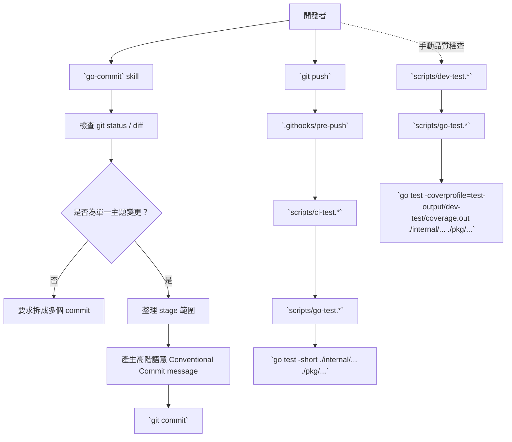

# `go-commit` 與 `pre-push` 測試工作流設計

## 快速導覽

- [目標與範圍](#目標與範圍)
- [設計摘要](#設計摘要)
- [架構總覽](#架構總覽)
- [元件職責](#元件職責)
- [commit message 規範](#commit-message-規範)
- [測試流程與腳本模式](#測試流程與腳本模式)
- [失敗處理與驗證](#失敗處理與驗證)
- [實作備註](#實作備註)

## 目標與範圍

本設計要解決兩個問題：

1. 讓本 repo 的 commit 行為與 commit message 風格收斂為一致流程。
2. 讓 `git push` 前一定執行精簡測試，但 `git commit` 本身不被測試流程拖慢。

本次範圍限定如下：

- commit skill 名稱固定為 `go-commit`
- commit message 格式採 `Conventional Commits`，使用 `type(scope): summary`，其中 `scope` 可選
- commit message 必須描述高階變更意圖、行為含意或架構含意，而不是列舉程式細節
- push 前測試僅覆蓋 `internal` 與 `pkg`
- 測試分成 `ci-test` 與 `dev-test` 兩種模式
- 落地方式採 repo 內版本控制的 Git `pre-push` hook，不依賴特定 agent 私有功能

本次不納入：

- `pre-commit` hook
- `commit-msg` hook
- 全專案所有目錄的測試自動化
- CI 平台設定或 remote pipeline 改動

[返回開頭](#快速導覽)

## 設計摘要

此方案採「skill 管流程、Git hook 管強制」的分工：

- `go-commit` 負責分析變更、整理 commit 範圍、決定 `type/scope`、產生高階語意的 commit message，最後才執行 `git commit`
- repo 內的 `pre-push` hook 負責在推送前呼叫 `ci-test`，若失敗則阻止 push
- `ci-test` 與 `dev-test` 共用同一套測試目標展開邏輯，只在執行模式與輸出內容上分流

這樣做有三個核心好處：

- 工具鏈中立：不管是 GitHub Copilot CLI、Claude Code、IDE，還是純手動 `git`，只要用同一個 repo 都能得到一致行為
- 摩擦可控：日常 commit 不被測試拖慢，但 push 仍有最基本的守門
- 易於擴充：未來若要把 `cmd`、`test` 或其他目錄納入，只需要補測試目標陣列，不必重寫腳本控制流

[返回開頭](#快速導覽)

## 架構總覽

設計重點不是把所有行為塞進 hook，而是把責任邊界切清楚：

- commit 階段關心的是「這次變更該怎麼被描述與切分」
- push 階段關心的是「這個版本至少有沒有通過最基本的快速測試」
- 本地想看 coverage 或做更完整檢查時，再手動跑 `dev-test`

[返回開頭](#快速導覽)

## 元件職責

以下元件主要位於 [scripts](../../../scripts) 與 [.claude/skills](../../../.claude/skills)；Git hook 入口則位於 repo root 的 `\.githooks`。

| 元件 | 預計路徑 | 職責 |
| --- | --- | --- |
| Commit skill | `\.claude\skills\go-commit\SKILL.md` | 定義統一 commit workflow：看 diff、判斷是否拆 commit、整理 stage、產生 message、執行 `git commit` |
| Shared test runner (PowerShell) | `scripts\go-test.ps1` | 於檔案開頭定義測試目標陣列，展開成 `go test` package pattern，供 `ci-test` / `dev-test` 共用 |
| Shared test runner (Shell) | `scripts\go-test.sh` | 與 PowerShell 版本等價，提供 hook 與 POSIX shell 環境使用 |
| CI test entrypoint | `scripts\ci-test.ps1` / `scripts\ci-test.sh` | 以快速模式執行測試，不做 coverage，供 `pre-push` 呼叫 |
| Dev test entrypoint | `scripts\dev-test.ps1` / `scripts\dev-test.sh` | 以完整模式執行測試，輸出 coverage profile 與摘要，供本地手動使用 |
| Hook installer | `scripts\install-git-hooks.ps1` / `scripts\install-git-hooks.sh` | 將本 repo 的 `core.hooksPath` 以 repo-local 設定指向相對路徑 `\.githooks`，且必須可重複執行 |
| Git pre-push hook | `\.githooks\pre-push` | 作為 push 前唯一守門入口；入口本身使用 shell，並呼叫 `scripts\ci-test.sh`，失敗即阻止 push |

這裡刻意避免把測試邏輯寫死在 hook 內。hook 應該只是很薄的入口層；真正的測試策略與目標展開邏輯應集中在 [scripts](../../../scripts) 內，才方便手動執行、除錯與擴充。由於 Git hook 入口天然更適合 shell 形式，PowerShell 版本保留給 Windows 使用者手動執行與除錯。

[返回開頭](#快速導覽)

## commit message 規範

### 核心規則

- 格式固定為 `type(scope): summary`
- `scope` 可省略，但若變更範圍明確，應優先保留
- `summary` 預設使用英文、祈使句、短句
- `summary` 必須描述高階變更意圖，讓未來整理 release notes 時可以直接抽取價值
- 不要把 `summary` 寫成「改了哪些檔案 / 哪些函式 / 哪些小步驟」

### 高階語意原則

好的 commit message 應回答：

- 這次變更提供了什麼能力？
- 修正了什麼行為或限制？
- 在架構上引入了什麼新概念？

而不是只回答：

- 改了哪些檔案
- 搬了哪些 function
- 調了哪些參數

### 例子

| 類型 | 例子 | 說明 |
| --- | --- | --- |
| 好例子 | `feat(logs): support size-based file rotation` | 描述新增能力，可直接進 release notes |
| 好例子 | `fix(errs): preserve wrapped error codes across joins` | 描述修正的邏輯意義 |
| 壞例子 | `feat(logs): edit writer.go and formatter.go` | 只描述改了哪些檔案，沒有高階含意 |
| 壞例子 | `refactor: update code for logs module` | 太籠統，無法作為未來變更摘要 |

### 建議 `type`

| `type` | 使用時機 |
| --- | --- |
| `feat` | 新能力、新對外行為、新 API |
| `fix` | 修 bug、修錯誤語義、修不正確行為 |
| `refactor` | 重構內部實作，但不改外部行為 |
| `docs` | 文件更新 |
| `test` | 測試補強或測試策略調整 |
| `chore` | 雜務、維護、不屬於功能/修正的工程性改動 |
| `perf` | 效能優化 |
| `build` | build、依賴、封裝相關變更 |
| `ci` | CI / hook / automation pipeline 相關變更 |

若一次變更混了多個高階意圖，`go-commit` 應優先要求拆 commit，而不是替混雜的修改硬湊一條 message。

[返回開頭](#快速導覽)

## 測試流程與腳本模式

### 共同測試目標

共享 runner 的檔案開頭只維護一份測試根目錄陣列，初始值固定為：

- `internal`
- `pkg`

展開後的測試 target 應形成：

- `./internal/...`
- `./pkg/...`

若未來要納入其他目錄，只需追加陣列元素，不修改模式判斷與主流程。

### 共同輸出與參數規則

`ci-test` 與 `dev-test` 都必須把執行資訊落地到 repo root 的 `test-output\`，供後續人工或 AI 排查使用。第一版採固定模式目錄，而不是散落在暫存路徑：

- `test-output\ci-test\`
- `test-output\dev-test\`

每次執行至少應落地以下資訊：

- `command.txt`：實際執行的 `go test` 指令
- `exit-code.txt`：本次執行的 exit code
- `stdout.log` 或對應格式的 stdout 主結果檔
- `stderr.log`：標準錯誤輸出

stdout 主結果檔的格式依額外參數而定：

- 預設情況：落地為一般文字 log
- 若外部額外傳入 `-json`：落地為可機器解析的 JSON Lines / NDJSON 結果檔

兩種腳本都必須接受額外傳入參數，並在保留各自預設模式旗標的前提下，原樣往 `go test` 傳遞。這代表：

- `ci-test` 會保留 `-short`
- `dev-test` 不帶 `-short`
- 額外參數例如 `-json`、`-run`、`-count=1` 都應被正確 passthrough

### `ci-test`

`ci-test` 的定位是「push 前快速守門」：

- 使用 `go test -short`
- 不產生 coverage
- 輸出以失敗資訊與必要摘要為主
- 預設由 `\.githooks\pre-push` 呼叫 `scripts\ci-test.sh`
- 執行結果固定落地到 `test-output\ci-test\`

### `dev-test`

`dev-test` 的定位是「本地品質檢查」：

- 不加 `-short`
- 產生 coverage profile
- 預設 coverage 輸出位置為 `test-output\dev-test\coverage.out`
- 額外輸出 coverage 摘要到 console，方便快速查看
- 執行結果固定落地到 `test-output\dev-test\`

### 模式分工表

| 模式 | 用途 | `-short` | Coverage | Artifact 目錄 | 主要觸發方 |
| --- | --- | --- | --- | --- | --- |
| `ci-test` | Push 前快速守門 | 是 | 否 | `test-output\ci-test\` | `pre-push` hook |
| `dev-test` | 本地完整檢查 | 否 | 是 | `test-output\dev-test\` | 開發者手動執行 |

[返回開頭](#快速導覽)

## 失敗處理與驗證

### 失敗處理原則

- `pre-push` 只要 `ci-test` 回傳非零 exit code，就必須中止 push
- PowerShell 與 shell 腳本都必須 fail-fast，不可吞錯
- 外部程式失敗（例如 `go test`、`git config`）必須正確傳遞 exit code
- `install-git-hooks` 在以下情境必須明確失敗並印出可操作訊息：
  - 當前目錄不是 Git repo
  - `git` 不存在
  - 無法寫入 repo-local config
- `install-git-hooks` 應優先寫入相對的 `core.hooksPath=.githooks`，避免 repo 搬動後 hook path 失效

### 驗證項目

落地後至少驗證以下事項：

1. `scripts\ci-test.*` 能正確只測 `internal` 與 `pkg`
2. `scripts\ci-test.*` 與 `scripts\dev-test.*` 都會建立對應的 `test-output\...\` 落地資料
3. `scripts\dev-test.*` 能產生 `test-output\dev-test\coverage.out`
4. 額外參數可被正確 passthrough；例如傳入 `-json` 時，落地主要結果檔為可解析的 JSON Lines / NDJSON
5. `scripts\install-git-hooks.*` 可重複執行，且 `git config core.hooksPath` 指向 `\.githooks`
6. `\.githooks\pre-push` 失敗時確實阻止 `git push`
7. `go-commit` skill 能產生高階語意、可作為 release note 素材的 commit message

[返回開頭](#快速導覽)

## 實作備註

- 本方案刻意採 Git 原生 `pre-push` hook，而不是綁定 Claude Code hooks 或 GitHub Copilot CLI 私有流程，避免工具更換時行為失真
- `pre-push` 是第一版唯一強制點；若未來發現 message 格式仍需硬性約束，再另外評估 `commit-msg` hook
- 測試腳本命名明確使用 `ci-test` / `dev-test`，讓使用情境在命名層就可辨識
- `test-output/` 應加入 [.gitignore](../../../.gitignore)，避免測試 artifact 污染版控
- 若未來 coverage 需要 HTML 報表，可在 `dev-test` 上追加，但不應污染 `ci-test` 的快速特性

[返回開頭](#快速導覽)
