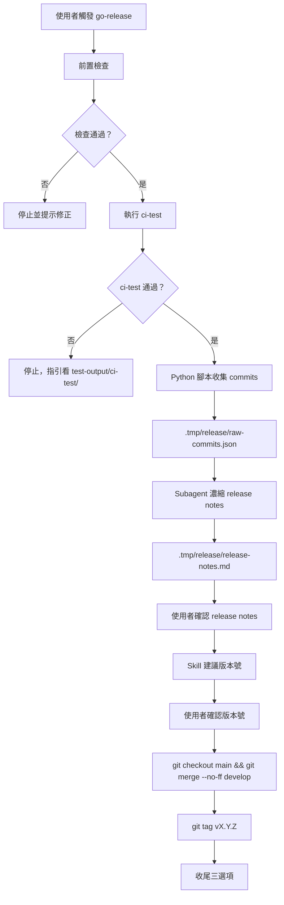

# `go-release` Skill 設計規格

## 快速導覽

- [目標與範圍](#目標與範圍)
- [設計摘要](#設計摘要)
- [架構總覽](#架構總覽)
- [完整流程](#完整流程)
- [前置檢查](#前置檢查)
- [Python 腳本設計](#python-腳本設計)
- [Release Notes 濃縮](#release-notes-濃縮)
- [版本號決策](#版本號決策)
- [Git 執行步驟](#git-執行步驟)
- [Hotfix 路徑](#hotfix-路徑)
- [收尾流程](#收尾流程)
- [Skill 檔案結構](#skill-檔案結構)
- [Evals 場景](#evals-場景)
- [go-commit Review 備註](#go-commit-review-備註)

## 目標與範圍

本設計定義 `go-release` agent skill，將 develop branch 的工作成果以 `--no-ff` merge 至 main、打上 Semantic Versioning tag、並產生濃縮的 release notes。

本次範圍：

- Agent skill（`.claude/skills/go-release/SKILL.md`）定義對話式 release 流程
- Python 腳本（`scripts/release-notes.py`）收集 Conventional Commits 並結構化分類
- LLM subagent 濃縮 release notes
- Lightweight tag（`git tag vX.Y.Z`）打在 main 的 merge commit 上
- 支援 hotfix 路徑（從 main branch 直接 release）

本次不納入：

- GitHub Release API 整合
- CI/CD pipeline 觸發
- CHANGELOG.md 自動維護
- Release branch（Git Flow 的 `release/*` 分支）
- Pre-release tag（`-rc.1`, `-beta.1` 等）

[返回開頭](#快速導覽)

## 設計摘要

此方案採「Skill 管 Git 流程 + Python 管 commit 收集 + LLM 管 release notes 濃縮」的三層分工：

- **Skill** 負責前置檢查、流程引導、執行 Git 指令、使用者互動
- **Python 腳本** 負責 deterministic 的 commit 收集與 Conventional Commits 解析，輸出結構化 JSON 到 `.tmp/`
- **LLM subagent** 在乾淨 context 中讀取 JSON，濃縮成人類可讀的 release notes

設計原則：

- 與 `go-commit` 風格一致：agent 直接執行 git 指令，對話式引導
- Token 效率：大量 commit 原文不進入主 context，由 Python 預處理 + subagent 在隔離 context 濃縮
- 工具鏈中立：Python 腳本可脫離 agent 獨立使用（`python scripts/release-notes.py`）

[返回開頭](#快速導覽)

## 架構總覽



[返回開頭](#快速導覽)

## 完整流程

1. **前置檢查** — 確認 branch、working tree、remote 狀態
2. **執行 ci-test** — 通過才繼續
3. **Python 腳本收集 commits** — 解析 last-tag..HEAD，輸出 JSON 到 `.tmp/release/raw-commits.json`
4. **Subagent 濃縮 release notes** — 讀 JSON、按重要性分類濃縮、寫回 `.tmp/release/release-notes.md`
5. **使用者確認 release notes** — Skill 展示濃縮後內容，使用者可修改
6. **Skill 建議版本號** — 根據 release notes 內容推斷 bump 層級
7. **使用者確認版本號** — 可接受或覆寫
8. **執行 merge** — `git checkout main && git pull && git merge --no-ff develop -m "release: vX.Y.Z"`
9. **打 tag** — `git tag vX.Y.Z`（lightweight tag）
10. **收尾問題** — 提供推送、同步 develop、或兩者都做的選項

[返回開頭](#快速導覽)

## 前置檢查

Skill 在開始前必須通過所有檢查，任一失敗即停止並提示可操作的修正方式。

| 檢查項 | 指令 | 失敗行為 |
|--------|------|---------|
| 在 develop branch 上 | `git branch --show-current` | 停止，提示切到 develop（除非 hotfix 路徑） |
| Working tree clean | `git status --short` | 停止，提示先 commit 或 stash |
| Local develop 與 remote 同步 | `git fetch && git rev-list HEAD..origin/develop` | 提示先 `git pull` |
| 有新 commits 自 last tag | `git describe --tags --abbrev=0` + `git log` | 提示無需 release |

若目前在 main branch 且自 last tag 以來有新 commits，視為 hotfix 路徑（見 [Hotfix 路徑](#hotfix-路徑)）。

[返回開頭](#快速導覽)

## Python 腳本設計

### 路徑

`scripts/release-notes.py`

### 依賴

純 Python stdlib：`subprocess`、`json`、`re`、`sys`、`os`、`pathlib`。不引入外部套件。

### 用法

```bash
# 自動偵測 last tag → HEAD
python scripts/release-notes.py

# 指定 commit 範圍
python scripts/release-notes.py v1.2.0..HEAD

# 輸出 raw markdown（不經 LLM，供手動使用）
python scripts/release-notes.py --format=markdown
```

### 輸出位置

- 預設輸出到 `.tmp/release/raw-commits.json`
- 腳本自行建立 `.tmp/release/` 目錄（若不存在）
- `--format=markdown` 模式輸出到 stdout

### JSON 輸出格式

```json
{
  "range": "v1.2.0..HEAD",
  "previous_tag": "v1.2.0",
  "commit_count": 15,
  "has_breaking": false,
  "groups": {
    "feat": [
      {"hash": "abc1234", "scope": "logs", "summary": "support size-based file rotation"}
    ],
    "fix": [],
    "refactor": [],
    "perf": [],
    "docs": [],
    "test": [],
    "chore": [],
    "build": [],
    "ci": []
  },
  "breaking_changes": [
    {"hash": "xyz999", "scope": "errs", "summary": "remove deprecated Wrap function", "note": "Use WrapWith instead"}
  ],
  "unparseable": [
    {"hash": "def456", "raw_message": "whatever doesn't follow convention"}
  ]
}
```

### 解析邏輯

- 使用 `git log --format='%H %s' <range>` 取得 commit hash + subject
- Conventional Commits regex：`^(\w+)(\([\w\-/]+\))?(!)?:\s+(.+)$`
- `!` 標記或 commit body 含 `BREAKING CHANGE:` → 歸入 `breaking_changes`
- 不符合格式的 commit → 歸入 `unparseable`
- 若無任何 tag，fallback 到 repo 首次 commit：`git rev-list --max-parents=0 HEAD`
- 以下 commit 預設排除，不歸入任何 group：
  - Git 自動產生的 merge commits（subject 以 `Merge ` 開頭）
  - 手動 merge 標記（subject 以 `merge:` 開頭，本 repo 慣例）
  - Release merge（subject 以 `release:` 開頭）
  - 排除的原因：這些是流程性 commit，實際變更已在被 merge 或 release 的 commits 中

### 錯誤處理

- 不在 git repo 中：exit code 1 + 明確 stderr 訊息
- 指定範圍無效：exit code 1 + stderr
- 零 commits 在範圍內：正常輸出空的 groups，由 skill 判斷是否繼續

[返回開頭](#快速導覽)

## Release Notes 濃縮

### 流程

Skill 啟動一個獨立 subagent（乾淨 context），指令如下：

1. 讀取 `.tmp/release/raw-commits.json`
2. 按以下排序濃縮：
   - **⚠️ Breaking Changes**（若有）
   - **✨ Features** — 每條一句話，描述使用者可感知的新能力
   - **🐛 Bug Fixes** — 每條一句話，描述修正的行為
   - **⚡ Performance** — 每條一句話
   - **🔧 其他改進** — `refactor`/`chore`/`ci`/`build`/`docs`/`test` 合併為一個 section，僅列有實際影響的項目
3. `unparseable` commits 附在最末，供人工檢視
4. 輸出寫入 `.tmp/release/release-notes.md`

### 濃縮原則

- 每個 entry 用一句話，描述「對使用者/操作者有何變化」
- 不列檔案名稱、不列函式簽名
- 若同一 scope 有多個相關 commits，合併描述
- `chore`/`ci`/`build`/`docs`/`test` 只在有實際影響時列出，否則跳過
- 總長度控制在合理範圍，避免 release notes 比 diff 還長

[返回開頭](#快速導覽)

## 版本號決策

### 時機

在使用者確認 release notes 之後，skill 根據 release notes 內容建議版本號。

### 建議邏輯

| 條件 | Bump 層級 |
|------|----------|
| Release notes 中有 Breaking Changes | **MAJOR** |
| Release notes 中有 Features | **MINOR** |
| 僅有 fixes、refactor、docs、chore 等 | **PATCH** |

### 互動方式

Skill 展示：
- 上一個版本號
- 建議的新版本號 + 理由（一句話）
- 使用者可接受或覆寫

若使用者輸入的版本號格式不符 `vMAJOR.MINOR.PATCH`，提示修正。

[返回開頭](#快速導覽)

## Git 執行步驟

Skill 在使用者確認版本號後，依序執行：

```bash
# 1. 切到 main 並確保最新
git checkout main
git pull origin main

# 2. Merge develop（保留歷史）
git merge --no-ff develop -m "release: vX.Y.Z"

# 3. 打 lightweight tag
git tag vX.Y.Z
```

### Merge commit message 格式

固定為 `release: vX.Y.Z`，不使用 Conventional Commits type prefix。原因：

- Release merge 是一個流程動作，不是功能或修復
- `release:` 前綴在 git log 中可清楚辨識
- 不會被 Python 腳本解析為 Conventional Commit（因為 `release` 不在 type 列表中，且 merge commit 預設排除）

### Conflict 處理

若 merge 產生 conflict：

1. Skill 通知使用者有 conflict
2. 列出 conflict 的檔案
3. 協助使用者解決（或建議 `git merge --abort`）
4. 解決後繼續 tag 步驟

[返回開頭](#快速導覽)

## Hotfix 路徑

當使用者在 main branch 上且自 last tag 以來有新 commits 待 release 時，走 hotfix 路徑。

### 偵測條件

- `git branch --show-current` 回傳 `main`
- `git log $(git describe --tags --abbrev=0)..HEAD --oneline` 有輸出（last tag 之後有新 commits）

### 流程差異

| 步驟 | 正常路徑 | Hotfix 路徑 |
|------|---------|------------|
| 前置 branch 檢查 | 必須在 develop | 必須在 main |
| ci-test | ✅ 執行 | ✅ 執行 |
| Python + subagent | ✅ 相同 | ✅ 相同 |
| Merge | `git merge --no-ff develop` | **跳過**（已在 main 上） |
| Tag | ✅ 打在 main HEAD | ✅ 打在 main HEAD |
| 收尾 | 提示推送 + 同步 develop | 提示推送 + **merge main 回 develop** |

### Hotfix 收尾

> Hotfix vX.Y.Z 完成。下一步：
> 1. 推送 main + tags 到 remote
> 2. 將 main merge 回 develop（`git checkout develop && git merge main`）
> 3. 以上都做

[返回開頭](#快速導覽)

## 收尾流程

### 正常 Release 收尾

Release 完成後，skill 以一個明確的問題結束：

> Release vX.Y.Z 完成。下一步：
> 1. 推送 main + tags 到 remote（`git push origin main --tags`）
> 2. 回到 develop 並同步 merge commit（`git checkout develop && git merge main`）
> 3. 以上都做

Skill 根據使用者選擇執行對應指令。不默默執行任何操作。

### 不做的事

- 不自動推送（即使使用者「可能想」推送）
- 不自動刪除任何 branch
- 不觸發任何外部服務（GitHub Release、CI 等）

[返回開頭](#快速導覽)

## Skill 檔案結構

```
.claude/skills/go-release/
├── SKILL.md              ← Skill 流程定義
└── evals/
    └── evals.json        ← 評估場景

scripts/
└── release-notes.py      ← Commit 收集與分類

.tmp/                     ← 暫存目錄（gitignored）
└── release/
    ├── raw-commits.json  ← Python 腳本產出
    └── release-notes.md  ← Subagent 濃縮產出
```

`.gitignore` 需新增 `.tmp/`。

[返回開頭](#快速導覽)

## Evals 場景

| ID | 場景 | 預期行為 |
|----|------|---------|
| 1 | 使用者在 feature branch 上要求 release | 停止並提示切到 develop |
| 2 | Working tree 有未提交的變更 | 停止並提示先 commit 或 stash |
| 3 | ci-test 失敗 | 停止並指引看 test-output/ci-test/ |
| 4 | 自 last tag 以來無新 commits | 提示無需 release |
| 5 | 正常 release 流程 | 觸發 Python → subagent → 確認 notes → 確認版本 → merge + tag |
| 6 | 使用者覆寫建議的版本號 | 接受並使用使用者指定的版本號 |
| 7 | Merge 產生 conflict | 通知使用者並協助解決或建議 abort |
| 8 | Hotfix 路徑（在 main 上） | 跳過 merge，直接 tag，收尾提示 merge 回 develop |
| 9 | Release notes 中有 breaking changes | 建議 MAJOR bump |
| 10 | 收尾提供三選項 | 不默默推送，等使用者選擇 |

[返回開頭](#快速導覽)

## go-commit Review 備註

在設計 go-release 的過程中，review 了現有的 go-commit skill。以下是可改進的建議，不影響 go-release 的設計：

### 做得好的地方

- Conventional Commits 格式正確，祈使語氣，高階語意優先
- Commit boundary 意識強，要求拆分混合意圖的變更
- 不阻塞 commit 流程（不跑測試），push 才守門
- Worktree 處理完整，防範 source branch 推斷的 anti-pattern
- Evals 覆蓋了 10 個主要場景

### 可改進建議

| 項目 | 說明 |
|------|------|
| 缺少 `!` breaking change 標記 | Conventional Commits spec 支援 `feat(scope)!: ...`，SKILL.md 未提及 |
| 缺少 `BREAKING CHANGE:` footer 範例 | 設計 spec 有提到 footer，但 SKILL.md 沒有格式範例 |
| Worktree 佔比過重 | 步驟 10-19 佔近一半篇幅，可考慮拆為獨立 section |
| Scope 慣例未明確定義 | 未說明 scope 應為 module 名（如 `logs`）還是目錄名 |
| 缺少 multi-line body 格式指引 | 何時用 bullet、何時用 prose 沒有規範 |

這些屬於「可以更好」的範疇，不影響 skill 的基本功能。若未來修訂 go-commit，可一併處理。

[返回開頭](#快速導覽)
